# 2. Архитектура системы

## Назначение

Архитектура описывает систему подготовки, хранения и использования нормативных актов в **FalkorDB agentic temporal graph knowledge database** с дополнительным слоем **Legal Nexus + Legal KnowQL**.

Главная задача архитектуры — минимизировать влияние LLM на юридически проверяемых участках и заменить его:

- графовыми структурами FalkorDB;
- GraphBLAS-алгоритмами;
- детерминированными UDF/procedures;
- формальным query planning;
- evidence verification;
- citation-safe retrieval.

## High-level architecture

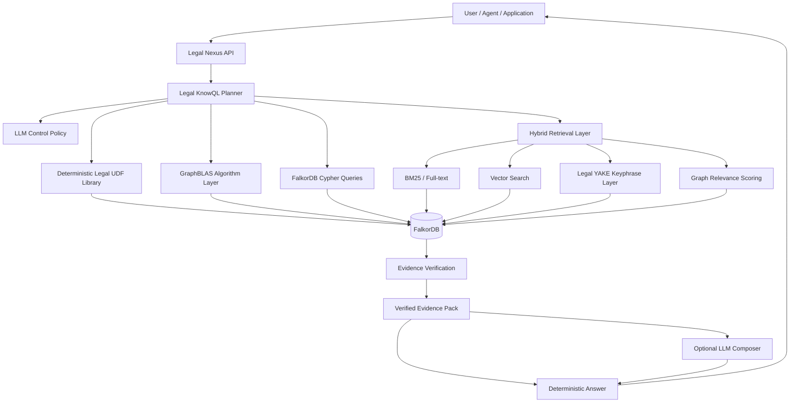

## Основные слои

### 1. Ingestion / ETL Layer

Отвечает за преобразование исходного WordML XML в нормализованные блоки и графовые сущности.

Вход:

- XML WordML нормативного акта;
- имя файла;
- MIME type;
- источник;
- дата импорта.

Выход:

- `SourceDocument`;
- `SourceBlock`;
- cleaned text;
- legal structure;
- evidence spans;
- graph nodes and relationships;
- import package для FalkorDB.

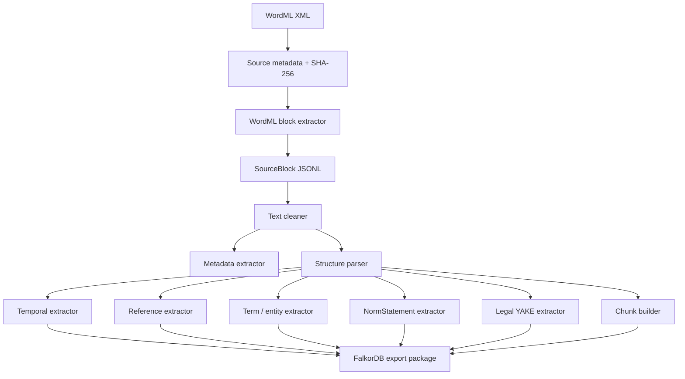

### 2. Authoritative Graph Layer

FalkorDB хранит authoritative legal graph.

Основные labels:

```text
SourceDocument
SourceBlock
LegalAct
ActEdition
Chapter
Article
Part
Clause
SubClause
Paragraph
EvidenceSpan
TextChunk
NormStatement
LegalTerm
LegalSubject
LegalConcept
Condition
Exception
Deadline
Reference
KeyPhrase
AutoTag
```

Основные relationships:

```text
HAS_EDITION
DERIVED_FROM
CONTAINS
NEXT
PREVIOUS
SUPPORTED_BY
LOCATED_IN
HAS_CHUNK
DEFINES
USES_TERM
REFERS_TO
APPLIES_TO
HAS_CONDITION
HAS_EXCEPTION
HAS_DEADLINE
HAS_KEYPHRASE
TAGGED_WITH
CANDIDATE_FOR
VERSION_OF
SUPERSEDES
AMENDED_BY
```

## Целевая графовая модель

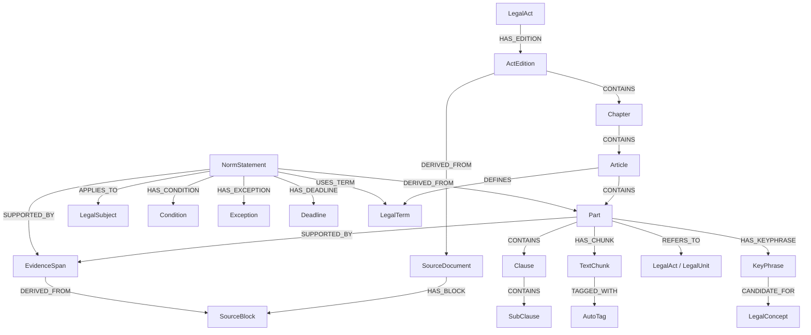

## 3. Temporal Layer

Temporal layer отвечает за применимость норм во времени.

Каждая юридическая единица должна иметь:

```json
{
  "edition_date": "2025-12-28",
  "valid_from": null,
  "valid_to": null,
  "effective_from": null,
  "effective_to": null,
  "status": "active",
  "temporal_confidence": "unknown"
}
```

Статусы:

```text
active
expired
future
partially_active
unknown
```

Temporal-проверка выполняется детерминированно через UDF:

```text
legal.active_at(node_id, date) → active / inactive / unknown
```

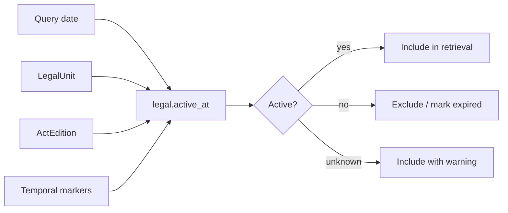

## 4. Evidence Layer

Evidence layer нужен для grounding.

Основная цепочка доказательства:

```text
NormStatement / TextChunk / Answer
  → EvidenceSpan
  → LegalUnit
  → SourceBlock
  → SourceDocument
```

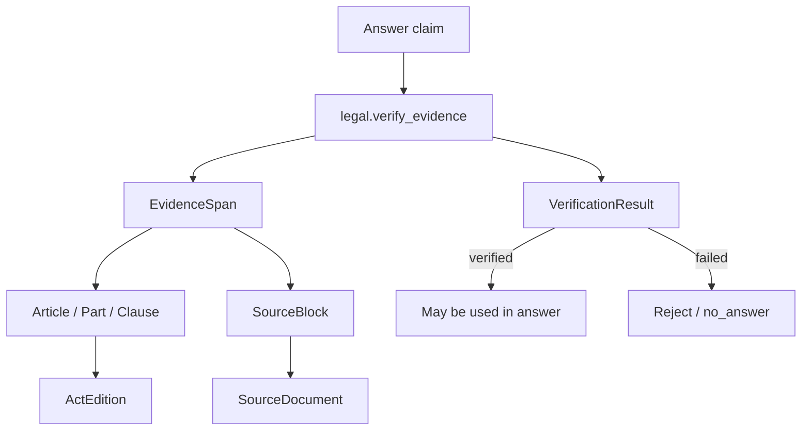

## 5. Legal Nexus Layer

Legal Nexus — orchestration layer между пользователем, агентом и FalkorDB.

Функции:

- intent detection;
- KnowQL parsing;
- deterministic query planning;
- вызов UDF;
- запуск GraphBLAS algorithms;
- hybrid retrieval;
- evidence verification;
- формирование citation-safe context;
- контроль использования LLM.

## 6. Legal KnowQL

Legal KnowQL — декларативный DSL для юридических запросов.

Примеры:

```sql
GET norm
WHERE act = "44-ФЗ"
AND article = "31"
AND part = "1"
AT "2025-12-28"
RETURN text, status, citation, evidence
```

```sql
FIND norm_statements
WHERE norm_type = "requirement"
AND subject = "участник закупки"
IN act = "44-ФЗ"
AT "2025-12-28"
RETURN statement, source_path, evidence
```

```sql
CHECK validity
OF "п. 4 ч. 1 ст. 31 44-ФЗ"
AT "2025-12-28"
RETURN status, temporal_evidence
```

## KnowQL execution flow

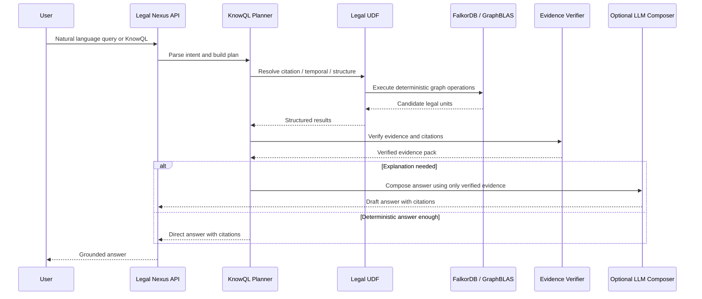

## 7. Deterministic UDF Library

Ключевые процедуры:

```text
legal.resolve_citation(citation, edition_date)
legal.active_at(node_id, date)
legal.get_norm(act, article, part, clause, date)
legal.get_article(act, article, edition_date)
legal.get_definition(term, date)
legal.find_requirements(subject, act, date)
legal.find_obligations(subject, act, date)
legal.find_prohibitions(subject, act, date)
legal.find_exceptions(scope, date)
legal.find_deadlines(scope, date)
legal.expand_references(node_id, depth, date)
legal.verify_evidence(claim, evidence_id)
legal.rank_candidates(query, candidates, date)
legal.build_context(query, candidates, max_scope)
legal.format_citation(node_id)
```

## 8. GraphBLAS Algorithm Layer

GraphBLAS используется для вычислимых графовых операций:

- controlled graph expansion;
- relevance propagation;
- reference closure;
- temporal subgraph filtering;
- graph-distance scoring;
- concept-neighborhood search;
- centrality scoring for norms;
- orphan node detection;
- duplicate / near-duplicate detection.

Пример relevance propagation:

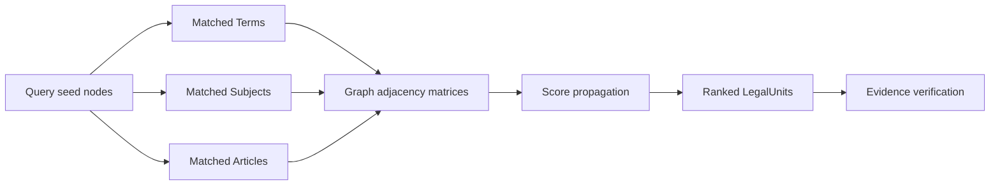

## 9. Hybrid Retrieval Layer

Retrieval состоит из нескольких источников сигналов.

```text
final_score =
    0.25 * structural_match
  + 0.20 * graph_relevance
  + 0.15 * bm25_score
  + 0.15 * vector_score
  + 0.10 * yake_keyphrase_match
  + 0.10 * temporal_validity
  + 0.05 * evidence_confidence
```

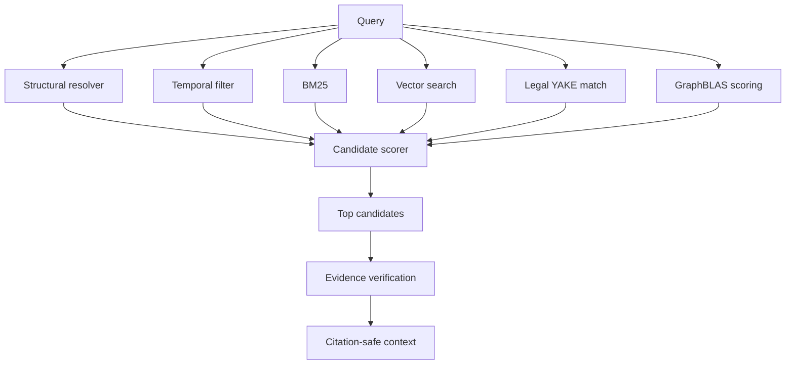

## 10. LLM Control Policy

LLM output is non-authoritative.

LLM запрещен для:

- structural lookup;
- temporal validity;
- citation resolution;
- evidence verification;
- status checks;
- source existence checks.

LLM разрешен для:

- natural language explanation;
- query rewrite candidate;
- ambiguous intent clarification;
- summarization of verified evidence;
- candidate semantic extraction with verification.

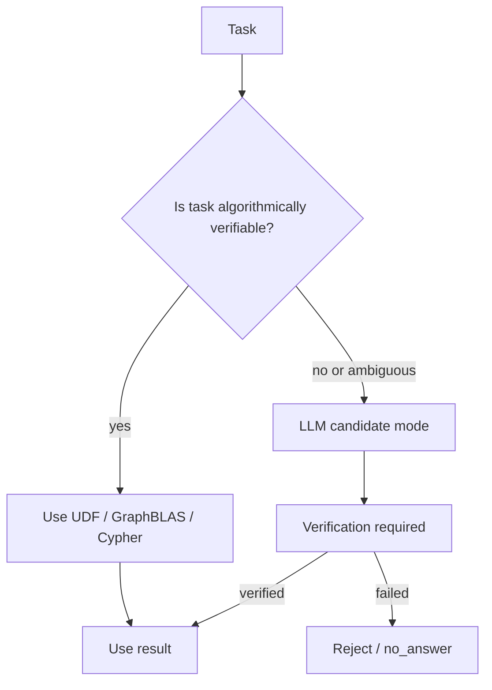

## 11. Import Package Architecture

Пакет импорта в FalkorDB:

```text
01_source_document.json
02_legal_act.json
03_source_blocks.jsonl
04_structure_nodes.jsonl
05_evidence_nodes.jsonl
06_norm_nodes.jsonl
07_entity_nodes.jsonl
08_term_nodes.jsonl
09_chunk_nodes.jsonl
10_keyphrase_nodes.jsonl
11_relationships.jsonl
12_embeddings.jsonl
13_import.cypher
14_validation_report.json
15_quality_report.json
16_retrieval_eval.json
17_cleaned.md
```

## 12. Validation Architecture

Перед импортом система должна валидировать пакет.

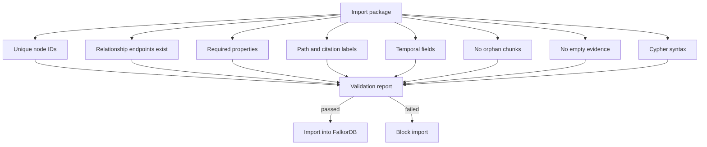

## 13. Deployment view

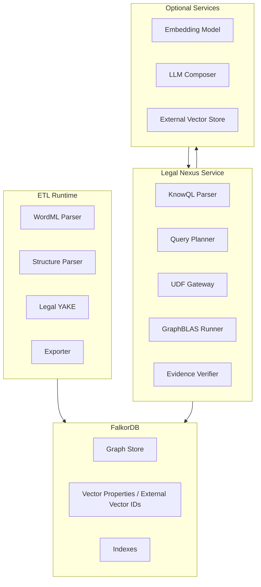

## 14. Архитектурный итог

Система реализует deterministic-first legal intelligence architecture:

- FalkorDB — authoritative legal knowledge substrate;
- Legal Nexus — orchestration and reasoning layer;
- Legal KnowQL — формальный язык запросов;
- GraphBLAS — вычислимое графовое reasoning ядро;
- UDF/procedures — проверяемая юридическая логика;
- Legal YAKE — легкий explainable semantic layer;
- LLM — non-authoritative language interface.
