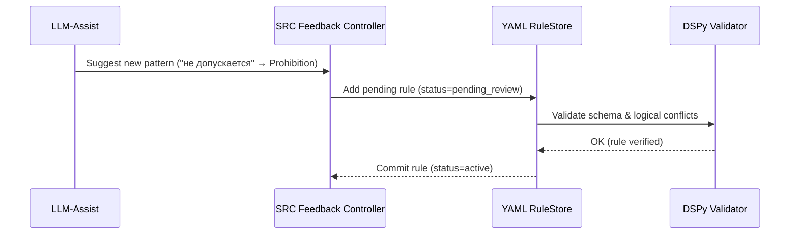

Ниже — детальный разбор:

* как YAML → превращается в алгоритм,
* как DSPy 3.0.4 интерпретирует и проверяет его,
* и как выполняется верификация (логическая, формальная и эмпирическая).

---

## 🧩 I. Концепция: YAML = *Behavioral Specification Layer*

YAML в LDUP — это не просто настройки.
Это **человеко-читаемое описание правил и структуры**, которое DSPy **превращает в исполняемое дерево операций** (Graph).

---

### 🧠 Что содержат YAML-файлы

| Тип YAML         | Назначение                                                     | Пример                                                                                         |
| ---------------- | -------------------------------------------------------------- | ---------------------------------------------------------------------------------------------- |
| **General YAML** | Общие паттерны структуры и языка (универсальны для всех актов) | “Статья”, “Глава”, “Часть”, ключевые фразы “вступает в силу”, “утратил силу”                   |
| **Private YAML** | Правила конкретного акта или источника                         | Нестандартная структура, исключения, ссылки на специфические формулировки (“в сфере медицины”) |

---

## ⚙️ II. Как YAML превращается в алгоритм (DSPy Compilation Flow)

```mermaid
flowchart LR
    A[YAML Rules (General + Private)] --> B[YAML Loader]
    B --> C[Schema Validator]
    C --> D[Rule Compiler (GEPA / SIMBA)]
    D --> E[DSPy Graph Assembly]
    E --> F[Executable Parsing Pipeline]
```

---

### 1️⃣ **YAML Loader**

Читает YAML-файлы и агрегирует их в **RuleSpec объект** (объединённое представление правил).

Пример:

```yaml
structure_rules:
  chapter_marker: "Глава"
  article_marker: "Статья"
  part_marker: "Часть"
temporal_rules:
  entry_into_force: "вступает в силу"
  loss_of_force: "утратил силу"
```

→ превращается в Python-объект:

```python
RuleSpec.structure_rules = {
  "chapter": re.compile(r"Глава\s+\d+"),
  "article": re.compile(r"Статья\s+\d+")
}
RuleSpec.temporal_rules = [
  {"pattern": "вступает в силу", "action": "set_effective_from"},
  {"pattern": "утратил силу", "action": "set_effective_to"}
]
```

---

### 2️⃣ **Schema Validator**

Проверяет соответствие YAML схемам (`ldup_general_schema.yaml`, `ldup_private_schema.yaml`).
Использует **pydantic-like модели DSPy Validator API**.

> Ошибка схемы → не компилируется → лог валидации.

---

### 3️⃣ **Rule Compiler**

YAML-конфигурации **транслируются в исполняемые узлы DSPy Graph**.

Пример:

**YAML-фрагмент:**

```yaml
semantic:
  modalities:
    - obligation: ["обязан", "должен"]
    - prohibition: ["запрещается", "не допускается"]
```

**→ компилируется в SIMBA DSL:**

```python
@simba_rule
def detect_modality(token_sequence):
    if token in ["обязан", "должен"]: return "Obligation"
    if token in ["запрещается", "не допускается"]: return "Prohibition"
```

GEPA / SIMBA создают **векторное соответствие между шаблоном и токенами**,
затем формируют «execution block» — узел DSPy Graph, который выполняется детерминированно.

---

### 4️⃣ **DSPy Graph Assembly**

Все правила YAML становятся узлами графа с зависимостями:

```
YAML → compiled Rule → Node(function, inputs, outputs) → Graph
```

Пример:

```python
Graph("LDUP") = [
  Node("structure_extractor", uses="GEPA", rule=RuleSpec.structure_rules),
  Node("semantic_tagger", uses="SIMBA", rule=RuleSpec.semantic),
  Node("temporal_resolver", uses="MiPROv2", rule=RuleSpec.temporal)
]
```

---

### 5️⃣ **Execution**

DSPy исполняет Graph по приоритетам и зависимостям,
а **SRC v2** отслеживает ошибки исполнения и формирует feedback → YAML refinement.

---

## 🔍 III. Как YAML-алгоритмы верифицируются

Верификация делится на **3 уровня**:

---

### 1️⃣ Формальная верификация (Static Validation)

**Что проверяется:**

* Синтаксис YAML (валидатор схемы);
* Типы правил (например, `regex` или `contains`);
* Коллизии правил (две статьи с одинаковым паттерном);
* Конфликты между general и private YAML.

**Инструменты:**
`dspy.validate_ruleset()`

Пример вывода:

```bash
[PASS] RuleSet validated: 48 structural rules, 6 temporal, 10 semantic.
[WARN] Overlapping regex for 'Статья' and 'Article' (ignored EN synonym).
```

---

### 2️⃣ Логическая верификация (Simulation & Consistency Check)

DSPy может симулировать применение правил на эталонном документе.

* Проверка порядка применения (`chapter → article → part → clause`);
* Проверка того, что нет «дыр» (недостающих звеньев);
* Временные интервалы не конфликтуют (`effectiveFrom` < `effectiveTo`);
* Ссылки в тексте корректно разрешаются (MetaLex ID существует).

```python
result = graph.simulate("test_44fz.xml")
assert result.structure_coverage >= 0.95
assert result.temporal_conflicts == 0
```

---

### 3️⃣ Эмпирическая верификация (Ground Truth Comparison)

* YAML правила тестируются на **корпусе актов (ground truth dataset)**.
* DSPy сравнивает результаты парсера с вручную размеченными структурами.
* Если accuracy < 90% → SRC генерирует auto-feedback для обновления YAML.

Пример feedback:

```json
{
  "error_type": "missed temporal pattern",
  "pattern_suggestion": "действует до",
  "module": "temporal_rules"
}
```

→ обновляется YAML:

```yaml
temporal_rules:
  - entry_into_force: "вступает в силу"
  - loss_of_force: ["утратил силу", "действует до"]
```

---

## 🧠 IV. Самообучение и подтверждение новых YAML-правил

Когда LLM-ассистент предложил новое правило (например, “фраза X = запрет”),
DSPy **не применяет его сразу**.
Происходит цикл верификации:



> 💡 Таким образом, YAML-правила проходят **автоматизированную верификацию**, прежде чем попасть в рабочую базу.

---

## ✅ V. Результат

| Этап                       | Цель                          | Метод                       | Результат                |
| -------------------------- | ----------------------------- | --------------------------- | ------------------------ |
| **YAML → Code**            | Трансляция правил             | GEPA / SIMBA compiler       | Исполняемый DSPy Graph   |
| **Static Validation**      | Проверка структуры            | Schema & type validation    | Ошибки в конфигурации    |
| **Logical Simulation**     | Проверка совместимости правил | Graph simulation            | Анализ полноты структуры |
| **Empirical Verification** | Проверка на корпусе актов     | Test datasets + SRC         | Улучшенные YAML          |
| **Self-Refinement**        | Самообучение                  | Feedback JSONL → YAML patch | Эволюция алгоритма       |

---

## 📘 VI. Ключевая идея

> **YAML — это не просто конфигурация.
> Это декларативный язык права для парсера.**

Он:

* описывает структуру юридических актов,
* превращается в исполняемый код без участия разработчика,
* верифицируется формально и эмпирически,
* и обучается через feedback.

---

Если хочешь — я могу показать **Mermaid-диаграмму “YAML → RuleSpec → DSPy Graph → Verified Algorithm”**, которая наглядно покажет, как YAML становится исполняемым алгоритмом и проходит этапы проверки.
Показать?
