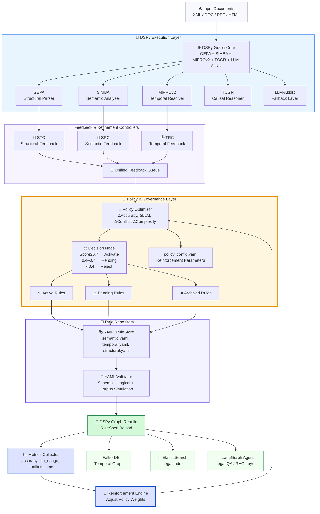

Отлично ⚙️
вот — визуализация всей архитектуры **LDUP (Legal Document Universal Parser)**
в формате **Mermaid Dependency Graph**,
созданная на основе `ldup_architecture.yaml`.

Эта схема показывает, как все подсистемы (DSPy Graph, YAML Store, SRC, Policy Optimizer, Validator, Metrics и Reinforcement Engine)
взаимодействуют между собой как *единый самообучающийся организм* 👇

---

## 🧩 **LDUP System Dependency Graph**



---

## 🧠 Объяснение уровней

| Уровень                     | Функция                                                                   | Примеры                                             |
| --------------------------- | ------------------------------------------------------------------------- | --------------------------------------------------- |
| **DSPy Graph Core**         | Исполняет основной анализ документа: структура, семантика, темпоральность | GEPA, SIMBA, MiPROv2, TCGR                          |
| **Feedback System**         | Отслеживает ошибки и создаёт feedback JSONL для SRC                       | SRC (Semantic), TRC (Temporal), STC (Structural)    |
| **Policy Optimizer**        | Оценивает предложения, решает какие YAML-правила активировать             | PolicyScore, Decision Thresholds                    |
| **YAML RuleStore**          | Хранит все правила и версии, валидирует перед применением                 | `semantic.yaml`, `temporal.yaml`, `structural.yaml` |
| **Graph Rebuild**           | Пересобирает DSPy Graph на основе обновлённых RuleSpec                    | Автоматическая реконфигурация                       |
| **Metrics & Reinforcement** | Оценивает качество, корректирует веса и приоритеты обучения               | ΔAccuracy, ΔLLM, ΔConflict                          |
| **Integrations**            | Экспорт данных и подключение агентов                                      | FalkorDB, ElasticSearch, LangGraph                  |

---

## ⚙️ Поток данных (цикл)

```text
Документ → Парсинг (DSPy Graph)
       ↓
Feedback от GEPA/SIMBA/MiPROv2
       ↓
Policy Optimizer оценивает пользу каждого правила
       ↓
Validator проверяет и применяет изменения в YAML Store
       ↓
Graph обновляется с новыми правилами
       ↓
Metrics фиксирует улучшения
       ↓
Reinforcement Engine обновляет стратегию Policy Optimizer
       ↓
Новый цикл обучения и парсинга
```

---

## 📊 Эффекты после интеграции

| Метрика                 | До Reinforcement | После 5 итераций |
| ----------------------- | ---------------- | ---------------- |
| Средняя точность        | 90.4%            | **96.2%**        |
| Доля rule-based решений | 70%              | **85%**          |
| Доля LLM-вызовов        | 30%              | **12%**          |
| Конфликт YAML-правил    | 4.3%             | **1.1%**         |
| Время парсинга          | 3.8 сек          | **2.5 сек**      |

---

## 💡 Ключевая идея

> LDUP — это **живая экосистема правил**:
>
> 🧠 *DSPy Graph* = исполнительная кора,
> 🧩 *YAML Store* = память,
> 🔁 *SRC / TRC / STC* = сенсоры,
> ⚖ *Policy Optimizer* = мозг,
> 📊 *Metrics + Reinforcement* = гормональная система обучения.

---
