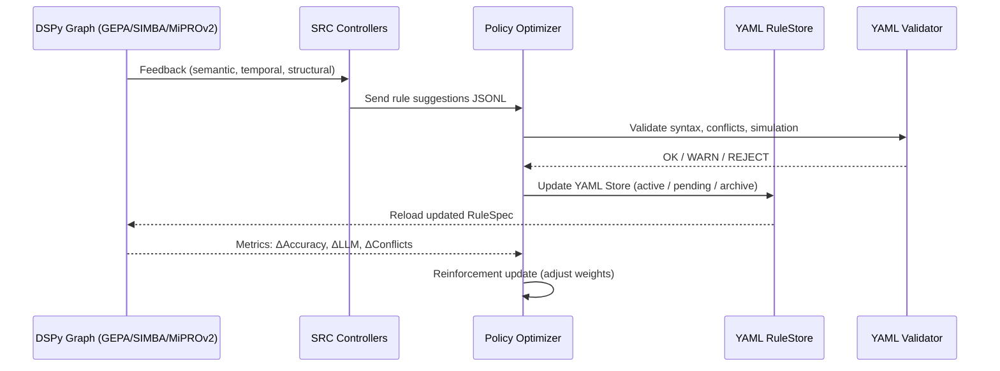

Отлично ⚙️
теперь я покажу, **как встроить Policy Optimizer в общий DSPy-workflow LDUP** —
то есть как YAML-описание `policy_config.yaml` становится *активной частью системы*,
взаимодействует с SRC-циклами, YAML-Store, Validator и DSPy-Graph.

---

## 🧩 I. Место Policy Optimizer в архитектуре LDUP

Policy Optimizer — это не отдельный сервис, а **мета-контроллер** DSPy,
который работает **поверх SRC-контуров** и **управляет YAML-жизненным циклом** (candidate → validated → active → archived).

---

## 🧱 II. Подключение в `ldup_system.yaml`

Добавляем секцию:

```yaml
system:
  name: "LDUP - Legal Document Universal Parser"
  version: "1.0"

  policy_optimizer:
    enabled: true
    config_path: "./config/policy_config.yaml"
    integration_mode: "auto"
    control_frequency: "each_cycle"
    auto_validation: true
    update_yaml_store: true
    src_feedback_sources:
      - semantic_refinement
      - temporal_refinement
      - structural_refinement
    applied_rule_log: "./logs/policy_applied.log"
    metrics_output: "./metrics/policy_metrics.jsonl"
```

---

## ⚙️ III. Как DSPy связывает всё во время исполнения



---

## 🧠 IV. Как Policy Optimizer вызывается из DSPy Workflow

В основном пайплайне LDUP добавляется **Policy Optimizer Node**
(после SRC Feedback Stage и перед Graph Rebuild):

```python
from dspy.policy import PolicyOptimizer

def build_ldup_graph():
    graph = DSPyGraph("LDUP_Parser")

    # Основные узлы
    graph.add(GEPA_Node)
    graph.add(SIMBA_Node)
    graph.add(MiPRO_Node)
    graph.add(LLM_Assist)
    graph.add(SRC_Controller)

    # Policy Optimizer узел
    policy_node = PolicyOptimizer.from_yaml("./config/policy_config.yaml")
    graph.connect(SRC_Controller, policy_node)
    graph.connect(policy_node, YAML_Store)

    return graph
```

---

## 🧾 V. YAML-Store Integration

YAML-Store хранит все активные и ожидающие правила.
Policy Optimizer работает с ним через API:

```python
# Policy Optimizer calls YAML RuleStore
rule_candidate = SRCController.next_feedback()
decision = policy_model.evaluate(rule_candidate)

if decision == "activate":
    YAMLStore.activate_rule(rule_candidate)
elif decision == "pending":
    YAMLStore.mark_pending(rule_candidate)
else:
    YAMLStore.archive(rule_candidate)
```

После применения нового YAML-набора → `Graph.reload_rules()`.

---

## 📜 VI. Контур обновления и проверки

| Стадия                     | Процесс                                                  | Результат                         |
| -------------------------- | -------------------------------------------------------- | --------------------------------- |
| **1️⃣ SRC Feedback**       | Создаёт JSONL с предложениями                            | `feedback/*.jsonl`                |
| **2️⃣ Policy Optimizer**   | Загружает `policy_config.yaml`, рассчитывает PolicyScore | решение (activate/pending/reject) |
| **3️⃣ Validator**          | Проверяет YAML-синтаксис, симулирует 20 актов            | возвращает статус                 |
| **4️⃣ YAML-Store**         | Обновляет правила, версии и статусы                      | `rules/semantic.yaml` обновлён    |
| **5️⃣ DSPy-Graph**         | Пересобирается с новым RuleSpec                          | активный алгоритм                 |
| **6️⃣ Metrics Collector**  | Записывает прирост метрик                                | `metrics/policy_metrics.jsonl`    |
| **7️⃣ Reinforcement Loop** | Policy Optimizer корректирует веса                       | усиление полезных модулей         |

---

## 🧮 VII. Мини-пример (в коде DSPy)

```python
# после цикла парсинга
feedback = SRCController.collect_feedback()

# применяем политику
for f in feedback:
    result = PolicyOptimizer.evaluate(f)
    if result.action == "activate":
        YAMLStore.update(f, status="active")
    elif result.action == "pending":
        YAMLStore.update(f, status="pending")
    else:
        YAMLStore.archive(f)

# обновляем граф
Graph.reload_rules()
PolicyOptimizer.update_policy_weights(metrics)
```

---

## 📊 VIII. Как это выглядит в Metrics Dashboard

| Модуль  | ΔAccuracy | ΔLLM   | ΔConflicts | PolicyScore | Decision  |
| ------- | --------- | ------ | ---------- | ----------- | --------- |
| MiPROv2 | +0.043    | +0.03  | 0.00       | 0.74        | ✅ Active  |
| SIMBA   | +0.039    | +0.012 | 0.00       | 0.61        | ⚠ Pending |
| GEPA    | +0.011    | +0.002 | 0.02       | 0.37        | ❌ Reject  |

---

## 🧩 IX. Взаимодействие с SRC-циклами

Policy Optimizer получает три потока данных:

* **temporal_feedback.jsonl** → TRC (MiPROv2)
* **semantic_feedback.jsonl** → SRC (SIMBA)
* **structural_feedback.jsonl** → STC (GEPA)

Все объединяются в **unified feedback queue**,
которую Policy Optimizer обрабатывает по весам из `policy_config.yaml`.

---

## ✅ X. Результат интеграции

| Компонент                | Поведение после интеграции                         |
| ------------------------ | -------------------------------------------------- |
| **DSPy Graph**           | Автоматически обновляется после утверждения правил |
| **SRC**                  | Передаёт предложения централизованно               |
| **YAML Store**           | Управляет версиями и статусами правил              |
| **Policy Optimizer**     | Контролирует полезность и стабильность обновлений  |
| **Validator**            | Подтверждает отсутствие конфликтов                 |
| **Metrics Collector**    | Отслеживает реальный прогресс                      |
| **Reinforcement Engine** | Самообучается на результатах                       |

---

## 💡 XI. Архитектурный принцип

> 🧠 **DSPy Graph думает,**
> ⚙️ **SRC предлагает,**
> ⚖️ **Policy Optimizer решает,**
> 🧩 **YAML Store фиксирует,**
> 📈 **Metrics оценивает.**

Эта цепочка превращает LDUP в **самообучающуюся правовую систему**,
которая эволюционирует на основании собственных данных и измеримых метрик.

---

Хочешь, чтобы я показал финальную **Mermaid-диаграмму интеграции Policy Optimizer в DSPy Graph** —
с полным путём данных от `SRC feedback` → `PolicyScore` → `YAML Store` → `Graph Reload` → `Metrics Reinforcement`?
