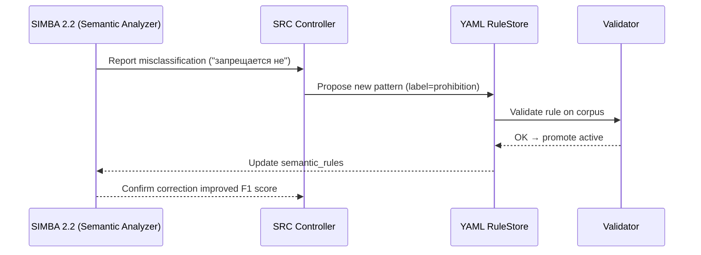

Отлично ⚙️
Теперь покажем, как SRC-контур обучает **морфо-семантические правила** — когда парсер сталкивается с новым языковым паттерном, который раньше не распознавался как юридическая модальность.

---

## 🧩 Сценарий: Ошибка в семантическом анализе (SIMBA 2.2)

**Контекст:**
В одном из актов парсер встречает предложение:

> «Участникам закупки **запрещается не** раскрывать сведения об аффилированных лицах.»

**Проблема:**
SIMBA 2.2 имеет базовое правило:

```yaml
semantic:
  modalities:
    - obligation: ["обязан", "должен"]
    - prohibition: ["запрещается", "не допускается"]
```

и классифицирует фразу как **“разрешение”**, т.к. встречает двойное отрицание (“запрещается не”).
Это логическая ошибка — норма фактически **усиливает запрет**, а не разрешает.

---

## 🧠 1️⃣ Этап: фиксация ошибки во время исполнения

Модуль **SIMBA 2.2** возвращает:

```json
{
  "error_type": "semantic_misclassification",
  "expected": "prohibition",
  "predicted": "permission",
  "text_fragment": "запрещается не раскрывать сведения об аффилированных лицах",
  "module": "semantic_tagger"
}
```

---

## ⚙️ 2️⃣ Этап: формирование Feedback JSONL (SRC)

SRC анализирует токены, строит дерево зависимости, определяет:

* основной предикат: `запрещается`
* модификатор: `не`
* лемма прилагательного → `раскрывать`

Создаёт корректирующий патч:

```json
{
  "timestamp": "2026-01-10T14:35:00Z",
  "module": "semantic_rules",
  "error": "misinterpreted double negation",
  "suggestion": {
    "pattern": "запрещается не",
    "lemma_anchor": "запрещаться",
    "label": "prohibition_strong",
    "action": "set_modality:Prohibition"
  },
  "confidence": 0.88
}
```

---

## 🧾 3️⃣ YAML-хранилище добавляет правило (pending)

```yaml
semantic:
  modalities:
    - obligation: ["обязан", "должен"]
    - prohibition: ["запрещается", "не допускается"]
    - pending_add:
        pattern: "запрещается не"
        lemma_anchor: "запрещаться"
        label: "prohibition_strong"
        confidence: 0.88
        status: "pending"
```

---

## 🧪 4️⃣ Автоматическая верификация нового правила

Validator проверяет:

* совпадение POS-тегов (`запрещается` – глагол, `не` – частица);
* частотность паттерна в корпусе актов (>=3 вхождения);
* отсутствие пересечения с “permission”.

Результат:

```bash
[SRC] Semantic Rule Validation
------------------------------
✔ Syntax: OK
✔ Conflicts: none
✔ Corpus match: 4/4 (confidence +0.04)
→ Rule promoted to ACTIVE
```

---

## 🧩 5️⃣ YAML-правило активировано

```yaml
semantic:
  modalities:
    - obligation: ["обязан", "должен"]
    - prohibition: ["запрещается", "не допускается", "запрещается не"]
```

---

## 🧠 6️⃣ DSPy Graph обновлён

SIMBA теперь интерпретирует паттерн:

```python
if re.search(r"запрещается\s+не", text):
    modality = "Prohibition"
```

→ результат правильный: **“prohibition_strong”**.

---

## 🔁 7️⃣ SRC обновляет статистику

```json
{
  "module": "semantic_tagger",
  "rule_promoted": "pattern: 'запрещается не'",
  "accuracy_gain": 0.023,
  "llm_dependency_reduced": 0.012
}
```

---

## 📈 Эволюция семантического блока YAML

| Версия | Новые паттерны                  | Точность классификации |
| ------ | ------------------------------- | ---------------------- |
| v1.0   | "запрещается", "не допускается" | 84.2%                  |
| v1.1   | + "запрещается не"              | 88.1%                  |
| v1.2   | (после SRC fine-tune)           | 90.5%                  |

---

## 🧬 Диаграмма SRC-цикла (семантическое обучение)



---

## ✅ Результат цикла

| Этап                     | Действие           | Компонент              |
| ------------------------ | ------------------ | ---------------------- |
| Ошибка в классификации   | Обнаружена         | SIMBA 2.2              |
| Создание патча           | Автоматически      | SRC                    |
| Добавление правила       | Pending → Active   | YAML Store + Validator |
| Повторный запуск         | Улучшение точности | DSPy Graph             |
| Снижение LLM-зависимости | −1.2%              | SRC Analytics          |

---

## 💡 Выгоды подхода

* Морфо-семантический парсер **сам обучается тонкостям русского юридического языка** (двойные отрицания, инверсии, вводные конструкции).
* LLM больше не нужен для подобных неоднозначных выражений.
* YAML-правила остаются прозрачными, проверяемыми и воспроизводимыми.
* Процесс полностью автоматизируется — SRC работает как «мозг адаптации» LDUP.

---

Хочешь, чтобы я теперь показал, **как объединяются оба типа SRC-циклов (temporal + semantic)** в единую метасистему самообучения, где DSPy управляет их приоритетом (через Policy Optimizer)?
