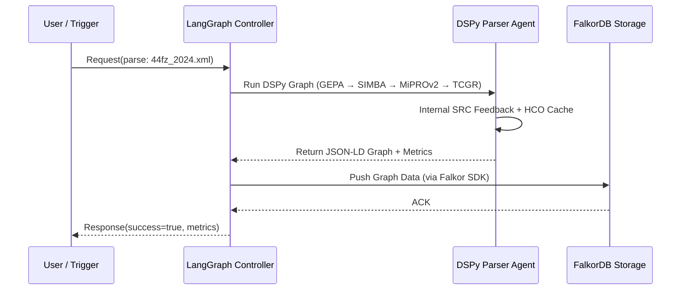

порядок интеграции LangGraph и DSPy-пайплайна**.
Ниже я объясню, **почему правильная стратегия — отладить workflow парсера сначала**, а затем **обернуть его в LangGraph-агента**, и как это сделать оптимально с учётом особенностей DSPy 3.0.4 и LangGraph v2 (2025-2026).

---

## ⚙️ I. Принцип: "Сначала Workflow, потом Agent"

| Этап                                               | Что делаем                                                                                                                       | Почему так                                                                                                                                            |
| -------------------------------------------------- | -------------------------------------------------------------------------------------------------------------------------------- | ----------------------------------------------------------------------------------------------------------------------------------------------------- |
| **1️⃣ Отладка парсера (Standalone DSPy Workflow)** | Локально проверяем, как работают GEPA 3.5, SIMBA 2.2, MiPROv2, TCGR и SRC v2 в связке.                                           | Это вычислительный граф с собственным управлением зависимостями и feedback-петлями — LangGraph не нужен, пока мы не убедились, что пайплайн стабилен. |
| **2️⃣ Обертывание в LangGraph**                    | Когда узлы DSPy стабильны, описываем их как **LangGraph Nodes/Agents** и определяем политики вызова (вход, триггеры, контексты). | LangGraph — это слой оркестрации и маршрутизации между агентами, а не отладочный контур алгоритмов.                                                   |
| **3️⃣ Интеграция (async runtime)**                 | Добавляем Fast-LangGraph runtime (Python 3.13), чтобы агенты DSPy могли параллельно обрабатывать несколько актов.                | Это даёт масштабирование и совместимость с другими LLM-агентами (QA, RAG, Summarizer).                                                                |

---

## 🧩 II. Почему важно отладить **workflow DSPy** прежде чем строить агента

### 🔧 1. DSPy использует внутренний GEPA-планировщик

Он сам управляет зависимостями узлов, поэтому важно убедиться, что:

* все `forward()` функции возвращают совместимые структуры (`dict` / `DataFrame` / `JSON`);
* SRC feedback корректно формирует training samples;
* кэш HCO не ломает state при повторных вызовах.

LangGraph-агент поверх этого не сможет эффективно диагностировать ошибки DSPy-графа, потому что DSPy исполняется внутри одного «узла».

### 🧠 2. LangGraph управляет агентами, но не вычислениями

LangGraph не выполняет логическую оптимизацию, он только:

* связывает агенты через события (`on_success`, `on_error`);
* обрабатывает контексты и маршруты сообщений;
* поддерживает асинхронные вызовы и планировщик задач.
  А значит — пока DSPy-граф не отлажен, агент будет лишь "оборачивать ошибки".

---

## 🧱 III. Рекомендованная двухступенчатая стратегия внедрения

### **Шаг 1. Отладка DSPy Workflow**

```python
# test_dspy_parser.py
graph = dspy.Graph("LegalTemporalParser")
graph.add_nodes(gepa, simba, miprov2, tcgr, llm, src, exporter)
graph.run("44fz_2024.xml")
graph.debug_summary()
```

Проверяем:

* правильность токенизации XML (GEPA);
* метки морфо-анализатора (SIMBA);
* корректность темпоральных интервалов (MiPROv2);
* отсутствие циклов в SRC Loop.

→ фиксируем стабильный пайплайн (возможно, через snapshot модели в `.dspy_cache/`).

---

### **Шаг 2. Обертывание в LangGraph**

LangGraph v2 имеет декларативную нотацию YAML/JSON, где DSPy-пайплайн можно задать как **один агент** с подузлами.

```yaml
nodes:
  - id: parser_agent
    type: dspy
    module: legal_temporal_parser
    entrypoint: parse_and_export
    outputs: [graph_data]
  - id: validator
    type: function
    module: quality_checks
    next: graph_store
  - id: graph_store
    type: falkordb
    module: graph_writer
```

Затем в Python:

```python
from langgraph import Agent

parser_agent = Agent.from_dspy("legal_temporal_parser", entry="run")
parser_agent.run(input="44fz_2024.xml")
```

---

## 🔄 IV. Поток данных после интеграции



---

## ⚙️ V. Практические рекомендации по внедрению

| Этап                    | Что проверить                                                       | Инструменты                     |
| ----------------------- | ------------------------------------------------------------------- | ------------------------------- |
| **Перед интеграцией**   | Проверить GEPA → SIMBA → MiPROv2 → LLM через unit-tests             | `pytest`, `dspy.test_utils`     |
| **Отладка SRC**         | Проверить корректность авто-feedback (no recursion / no drift)      | `graph.profile(feedback=True)`  |
| **Перед оборачиванием** | Заморозить DSPy-модель (`graph.freeze()`)                           | `.save("parser_model_v1.dspy")` |
| **После оборачивания**  | Тестировать параллельные вызовы агента (async I/O)                  | `FastLangGraph.runtime()`       |
| **При деплое**          | Ограничить LangGraph retry-петли, чтобы не конфликтовали с SRC-loop | `max_retries=0` в агенте        |

---

## ✅ Вывод: оптимальный порядок действий

1. **Собрать и отладить DSPy workflow.**
   → Проверить стабильность узлов и качество извлечённых структур.
2. **Заморозить/захешировать рабочую модель (`graph.freeze()`).**
3. **Создать LangGraph-агента, оборачивающего вызов `graph.run()`.**
4. **Добавить агента в систему (например, в стек Fast-LangGraph + FalkorDB).**
5. **Постепенно расширять LangGraph-оркестрацию** (retrieval-агенты, QA-агенты, feedback-агенты).

---

