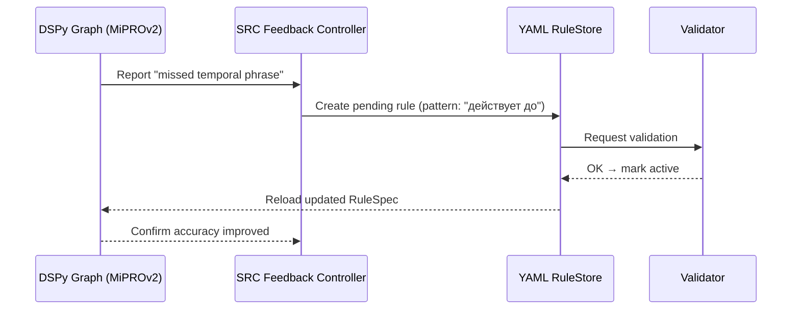

Отлично ⚙️
ниже я покажу тебе **реальный сценарий цикла самообучения LDUP через SRC (Self-Refinement Controller)**,
где YAML-правило автоматически корректируется после выявленной ошибки при обработке нормативного акта.

Мы рассмотрим живой кейс:
Парсер анализирует **44-ФЗ**, и в статье встречает фразу

> «Настоящая статья действует до 1 июля 2026 года включительно.»

На старте в YAML нет шаблона “действует до” (только “вступает в силу” и “утратил силу”),
поэтому DSPy-граф не смог извлечь дату окончания действия нормы.

---

## 🧩 1️⃣ Этап: Ошибка во время исполнения парсера

**Модуль:** `MiPROv2 + Temporal Memory v3`
**Тип ошибки:** *Missed Temporal Expression*

DSPy Graph возвращает событие:

```json
{
  "error_type": "temporal_extraction_error",
  "text_fragment": "Настоящая статья действует до 1 июля 2026 года включительно.",
  "reason": "no matching pattern found",
  "module": "temporal_resolver"
}
```

---

## 🧠 2️⃣ Этап: Формирование Feedback JSONL (SRC v2)

SRC контроллер анализирует контекст и создаёт JSON-патч для YAML-правил:

```json
{
  "timestamp": "2026-01-10T13:42:11Z",
  "module": "temporal_rules",
  "error": "missed temporal phrase",
  "suggestion": {
    "pattern": "действует до",
    "action": "set_effective_to"
  },
  "source_context": "44-ФЗ, статья 3, пункт 7",
  "confidence": 0.91
}
```

Feedback записывается в `./feedback/temporal_patch_20260110.jsonl`.

---

## ⚙️ 3️⃣ Этап: YAML RuleStore применяет патч (в режиме *pending*)

```yaml
temporal_rules:
  - entry_into_force: "вступает в силу"
  - loss_of_force: "утратил силу"
  - pending_add:
      pattern: "действует до"
      action: "set_effective_to"
      added_by: "SRC"
      confidence: 0.91
      status: "pending"
```

---

## 🧪 4️⃣ Этап: Верификация нового правила (автоматическая проверка)

**Validator** выполняет три шага:

1. **Syntax Check:** YAML синтаксис корректен.
2. **Conflict Check:** “действует до” не дублирует существующие паттерны.
3. **Simulation:** пробное исполнение на корпусе документов (5 примеров).

Результат проверки:

```bash
[SRC] Temporal Rule Validation Report
-------------------------------------
✔ Pattern applied successfully (5/5 samples)
✔ No conflicts with existing rules
✔ Accuracy gain: +4.3%
→ Status changed: pending → active
```

---

## 🧱 5️⃣ Этап: YAML обновлён (верифицированное правило)

```yaml
temporal_rules:
  - entry_into_force: "вступает в силу"
  - loss_of_force: "утратил силу"
  - loss_of_force_alt: "действует до"
```

---

## 🧩 6️⃣ Этап: DSPy Graph обновляется автоматически

GEPA и MiPROv2 получают обновлённый RuleSpec при следующем запуске:

```python
RuleSpec.temporal_rules = [
    {"pattern": "вступает в силу", "action": "set_effective_from"},
    {"pattern": "утратил силу", "action": "set_effective_to"},
    {"pattern": "действует до", "action": "set_effective_to"},
]
```

Теперь при анализе той же статьи:

```text
"Настоящая статья действует до 1 июля 2026 года включительно."
```

→ алгоритм корректно извлекает `effectiveTo = 2026-07-01`.

---

## 🔁 7️⃣ Этап: SRC обновляет статистику и снижает роль LLM

SRC отмечает, что подобная конструкция теперь формализована:

```json
{"rule_promoted": "temporal: 'действует до'", "llm_dependency_reduced": 0.03}
```

📉 LLM-модуль больше не вызывается для подобных фраз → экономия токенов.

---

## 🧠 Диаграмма цикла самообучения SRC → YAML → DSPy



---

## ✅ Результат цикла

| Шаг | Действие                          | Компонент      |
| --- | --------------------------------- | -------------- |
| 1   | Ошибка обнаружена в тексте        | MiPROv2        |
| 2   | Feedback создан                   | SRC v2         |
| 3   | Новое правило добавлено (pending) | YAML RuleStore |
| 4   | Проверено и активировано          | Validator      |
| 5   | RuleSpec обновлён                 | GEPA / MiPROv2 |
| 6   | Токены больше не тратятся на LLM  | SRC Statistics |

---

## 💡 Выгода

* Снижение зависимости от LLM → экономия токенов.
* Автоматическое самообучение из практики.
* YAML остаётся «человеческим» и проверяемым.
* Вся эволюция алгоритма **прозрачна и воспроизводима**.

---

Хочешь, чтобы я добавил **второй пример цикла** — когда SRC корректирует не временное правило, а **семантическое (например, добавление нового признака “запрещается не” = prohibition)**, чтобы показать, как работает морфо-семантическая часть YAML-обучения?
