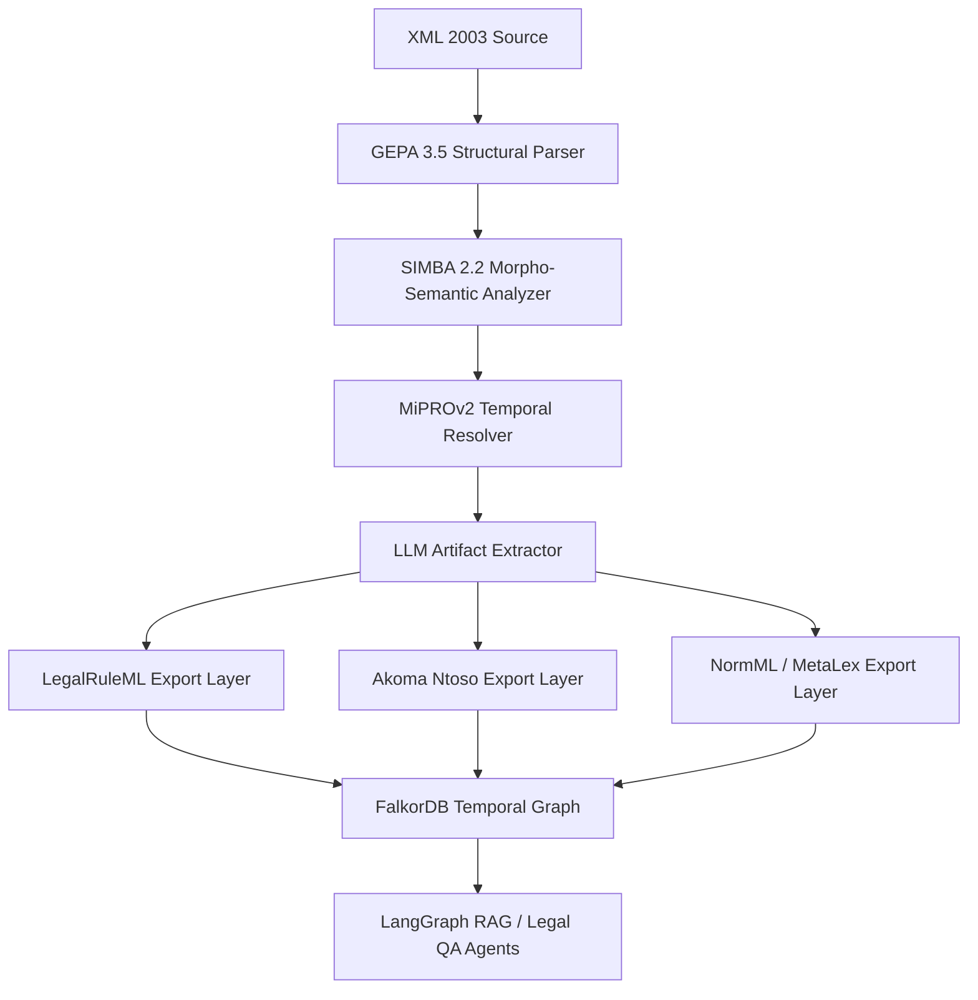

Вот детальный анализ — с фокусом именно на том, **как каждый стандарт можно интегрировать в архитектуру твоего гибридного парсера (HLTP)**, чтобы автоматическое извлечение структуры, артефактов и временных данных было совместимо с мировыми Legal Knowledge Graph системами.

---

## ⚖️ I. Основные XML-стандарты LegalTech (2025–2026)

| Стандарт                              | Организация / Проект | Цель                                                                      | Где используется                      |
| ------------------------------------- | -------------------- | ------------------------------------------------------------------------- | ------------------------------------- |
| **LegalRuleML (OASIS)**               | OASIS LegalDocML TC  | Формализация норм права, временных условий, обязанностей, запретов        | EU, OECD, Минюст Италии, Австралия    |
| **Akoma Ntoso (AKN)**                 | UNDESA / OASIS       | Универсальная XML-схема представления законодательных актов, суд. решений | ООН, ЕС, Африка, Латинская Америка    |
| **CEN Metalex**                       | CEN/ISSS             | Метаформат юридических документов, легковесная альтернатива AKN           | Европа, Нидерланды, Open Data проекты |
| **LegalDocML-Russia** *(проект 2025)* | Минцифры РФ / ИСО    | Русская адаптация AKN + LegalRuleML (в пилоте КонсультантПлюс и ГАРАНТ)   | РФ                                    |
| **NormML (Stanford 2025)**            | Stanford CodeX       | Сжатый XML-фреймворк для нормативных фактов и ссылок                      | Legal Graph datasets / LLM finetuning |
| **ECLI / ELI**                        | EU Commission        | Идентификаторы дел и законов в XML                                        | ЕС, e-Court, Legal Linked Data        |

---

## 📜 II. Как каждый стандарт относится к твоему парсеру

Ты строишь **гибридный парсер нормативных актов РФ (XML 2003 КонсультантПлюс)**, который:

* должен понимать **структуру акта** (глава → статья → пункт),
* извлекать **артефакты** (обязанность, запрет, определение, санкция),
* фиксировать **временные интервалы действия норм**,
* и сохранять в **GraphRAG + Temporal Layer (FalkorDB/Graffiti)**.

Теперь — как конкретные стандарты сюда ложатся 👇

---

### 🧩 1. **Akoma Ntoso (AKN)**

📘 *Стандарт №1 для юридических XML-документов.*

#### Структура:

```xml
<akomaNtoso>
  <bill>
    <meta>
      <identification source="#parliament">
        <FRBRWork uri="/akn/ru/act/2013-04-05/44-fz"/>
      </identification>
    </meta>
    <body>
      <chapter eId="ch1">
        <heading>Глава 1. Общие положения</heading>
        <article eId="art1">
          <num>Статья 1</num>
          <heading>Сфера применения</heading>
          <paragraph eId="art1.par1">
            <content>Настоящий закон регулирует...</content>
          </paragraph>
        </article>
      </chapter>
    </body>
  </bill>
</akomaNtoso>
```

#### Как интегрировать:

| Задача              | Соответствие в твоём парсере                                      |
| ------------------- | ----------------------------------------------------------------- |
| **Иерархия**        | GEPA 3.5 → `<chapter>`, `<article>`, `<paragraph>`                |
| **Версии и ссылки** | MiPROv2 → `<FRBRExpression>` и `<FRBRManifestation>`              |
| **Семантика норм**  | LLMNode / SIMBA → `<componentRef>` (обязанность, запрет, санкция) |
| **Graph экспорт**   | RDF*/JSON-LD через `<analysis>` блок AKN                          |

#### Преимущества:

* идеально подходит под **российскую иерархию “Глава–Статья–Пункт”**,
* поддерживает **temporal validity** и **cross-references** (через `href`),
* легко конвертируется в LegalRuleML.

---

### ⚖️ 2. **LegalRuleML (OASIS)**

📘 *Расширение Akoma Ntoso для логики и деонтики.*

#### Пример:

```xml
<lrml:LegalRuleML xmlns:lrml="http://docs.oasis-open.org/legalruleml/ns/v1.0/">
  <lrml:Rule id="R1">
    <lrml:appliesSource href="#art1.par1"/>
    <lrml:hasTemporalCharacteristic>
      <lrml:EffectiveTime>
        <lrml:start>2023-01-01</lrml:start>
        <lrml:end>2025-01-01</lrml:end>
      </lrml:EffectiveTime>
    </lrml:hasTemporalCharacteristic>
    <lrml:hasModality>Obligation</lrml:hasModality>
    <lrml:hasSubject>ContractingAuthority</lrml:hasSubject>
  </lrml:Rule>
</lrml:LegalRuleML>
```

#### Как использовать в HLTP:

| Компонент парсера | Как мапится в LegalRuleML                               |
| ----------------- | ------------------------------------------------------- |
| MiPROv2           | `<EffectiveTime>` / `<TemporalCharacteristic>`          |
| SIMBA + LLM       | `<hasModality>` (Obligation / Permission / Prohibition) |
| GEPA              | `<appliesSource>` (article, paragraph)                  |
| TCGR              | `<derivesFrom>` и `<causedBy>`                          |
| SRC Loop          | `<ruleRefinement>` — для версий правил                  |

#### Почему важно:

LegalRuleML позволяет **перевести результаты твоего парсера в логику правоприменения**
(“если A, то обязан B в срок C”), что делает твой Temporal Graph юридически интерпретируемым.

---

### 🧩 3. **CEN MetaLex**

📘 *Метаданные и идентификаторы актов и фрагментов.*

#### Пример:

```xml
<metalex:Fragment xml:id="art1.par2">
  <metalex:expressionRef href="#44fz-2024"/>
  <metalex:text>Действует до 01.01.2025.</metalex:text>
</metalex:Fragment>
```

#### Роль в парсере:

* GEPA может использовать MetaLex **идентификаторы (`xml:id`)** для узлов;
* помогает строить **stable URIs для RDF-графа**;
* интегрируется с FalkorDB (Graph key = `FRBRExpression@id`).

---

### 🧩 4. **NormML (Stanford, 2025)**

📘 *Минималистичный формат для fine-tuning LLM и автоматического reasoning.*

#### Пример:

```xml
<norm>
  <id>44fz.art31</id>
  <type>obligation</type>
  <text>Заказчик обязан предоставить обеспечение контракта.</text>
  <effectiveFrom>2024-01-01</effectiveFrom>
</norm>
```

#### Применение:

NormML подходит для обучения LLM на корпусе норм, извлечённых твоим парсером.
Ты можешь экспортировать JSON в NormML и использовать его в **SRC self-improvement** (auto-labeling).

---

### 🧩 5. **LegalDocML-Russia (проект 2025)**

📘 *Русская адаптация Akoma Ntoso + LegalRuleML.*

#### Особенности:

* поддерживает русскую терминологию (`<Глава>`, `<Статья>`, `<Пункт>`);
* содержит словари юридических синонимов (в т.ч. “обязан”, “должен”, “вправе”);
* интеграция с *XML 2003 КонсультантПлюс* планируется в 2026.

#### Практическая выгода:

Если ты реализуешь совместимость с LegalDocML-Russia, твой парсер станет **готов к промышленной интеграции с системами КонсультантПлюс и Минюст РФ**.

---

## 🧠 III. Как адаптировать твой парсер под эти стандарты

### ✅ Базовая стратегия совместимости

| Цель                              | Что делать в парсере                                                          |
| --------------------------------- | ----------------------------------------------------------------------------- |
| Совместимость с AKN               | Добавить экспорт `to_akn()` после GEPA.                                       |
| Совместимость с LegalRuleML       | Добавить слой преобразования артефактов (SIMBA + MiPROv2 → RuleML-структуры). |
| Совместимость с MetaLex           | Присваивать стабильные ID (e.g. `44fz-2024-art31-par2`).                      |
| Совместимость с NormML            | Добавить экспорт в JSON для обучения LLM и feedback SRC.                      |
| Совместимость с LegalDocML-Russia | Добавить словарь морфемных синонимов (pymorphy3 + SIMBA).                     |

---

### 🔧 Пример фрагмента экспорта Akoma Ntoso из твоего парсера

```python
akn = {
  "akomaNtoso": {
    "bill": {
      "meta": {
        "identification": {
          "FRBRWork": "/akn/ru/act/2013-04-05/44-fz"
        }
      },
      "body": {
        "chapter": {
          "heading": "Глава 1. Общие положения",
          "article": {
            "num": "Статья 1",
            "paragraph": {
              "content": "Настоящий закон регулирует отношения...",
              "effectiveFrom": "2023-01-01",
              "effectiveTo": "2025-01-01"
            }
          }
        }
      }
    }
  }
}
```

---

## 🧩 IV. Интеграция стандартов в архитектуру HLTP



---

## ✅ Вывод

| Цель                                        | Рекомендованный стандарт    | Где реализовать        |
| ------------------------------------------- | --------------------------- | ---------------------- |
| **Структура закона (глава, статья, пункт)** | Akoma Ntoso / LegalDocML-RU | GEPA 3.5               |
| **Временные интервалы**                     | LegalRuleML                 | MiPROv2                |
| **Модальности норм (обязанность, запрет)**  | LegalRuleML                 | SIMBA + LLMNode        |
| **Стабильные идентификаторы и ссылки**      | MetaLex                     | Graph Builder          |
| **Обучение моделей (SRC, LLM)**             | NormML                      | LLMNode / SRC Feedback |
| **Совместимость с российскими LegalTech**   | LegalDocML-Russia           | Экспорт Layer          |

---

Хочешь, чтобы я показал тебе **Mermaid-схему соответствия стандартов → модулей парсера (mapping matrix)** — то есть, где AkomaNtoso, LegalRuleML, MetaLex и NormML ложатся в DSPy workflow и как данные трансформируются между ними?
