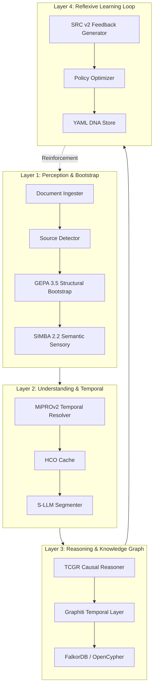

# LDUP v1.0 General Architecture (SALTP 2026) — v2.1

Эта схема описывает нейро-символьную иерархию системы, объединяющую декларативные правила и рефлексивные графы DSPy.

## 🔗 Источники и обоснования (v2.1)

### 1. DSPy Framework (v3.0+)
*   **GEPA (Reflective Prompt Evolution)**: https://dspy.ai/tutorials/gepa_ai_program/ (раздел “GEPA AI Program Tutorial”)
    *   GitHub v3.0.4: https://github.com/stanfordnlp/dspy/blob/3.0.4/dspy/teleprompt/gepa/gepa.py#L148
*   **SIMBA Optimizer**: https://dspy.ai/api/optimizers/SIMBA/ (раздел “SIMBA”)
    *   GitHub v3.0.4: https://github.com/stanfordnlp/dspy/blob/3.0.4/dspy/teleprompt/simba.py#L16
*   **MIPROv2 Optimizer**: https://dspy.ai/api/optimizers/MIPROv2/ (раздел “MIPROv2”)
    *   GitHub v3.0.4: https://github.com/stanfordnlp/dspy/blob/3.0.4/dspy/teleprompt/mipro_optimizer_v2.py#L47
*   **Teleprompters / Optimizers**: https://dspy.ai/api/optimizers/ (раздел “Optimizers”) — используется на compile-time.
*   **Signature API**: https://dspy.ai/api/signatures/Signature/ (раздел “Signature”)
    *   GitHub v3.0.4: https://github.com/stanfordnlp/dspy/blob/3.0.4/dspy/signatures/signature.py#L240
*   **DSPy Cache**: https://dspy.ai/api/utils/configure_cache/ (раздел “configure_cache”)
    *   GitHub v3.0.4: https://github.com/stanfordnlp/dspy/blob/3.0.4/dspy/clients/cache.py#L18

### 2. Внешние системы и GraphRAG
*   **Graphiti + FalkorDB**: https://docs.falkordb.com/agentic-memory/graphiti.html (темпоральные графы)
*   **Graphiti MCP**: https://www.falkordb.com/blog/mcp-knowledge-graph-graphiti-falkordb/ (persistent memory layer)

### 3. Внутренние проектные спецификации
*   **Rule-First Economy**: `docs/project_v1/Arch_v0.03_apdx_*Rule-First vs LLM-Assist Flow (LDUP Token Economy Architecture).md`
*   **Architectural YAML Layer**: `docs/project_v1/Arch v.0.3 YAML = Behavioral Specification Layer.md`
*   **Standards**: `docs/project_v1/standarts.md`

## ⚙️ Execution Model (Compile-time vs Run-time)

*   **Compile-time**: Teleprompters (GEPA/SIMBA/MIPROv2) оптимизируют DSPy-программу на обучающих наборах.
*   **Run-time**: Запускается уже скомпилированный `dspy.Module` и применяются YAML-правила.
*   **HCO Cache**: LDUP-специфичный слой, использующий DSPy cache как основу, но кэширует семантические результаты на уровне блоков документа.

## 🧾 Модель данных и валидация

*   **Typed Outputs**: структура `Document → Chapter → Article → Clause → Subclause` оформляется через `dspy.Signature` + Pydantic.
*   **Structural Validation**: проверка иерархии (Article ∈ Chapter) до выхода в экспорт.
*   **Semantic Validation**: контроль модальностей (обязанность/запрет/разрешение) и логических коллизий.
*   **Temporal Validation**: ограничения `valid_from < valid_to` и конфликтов редакций.

## ♻️ Самоулучшение и версионирование YAML

*   **Auto‑Diagnostics**: любые нарушения (границы статьи, подпункты кириллицей, редакционные вставки, ссылки в `screenTip`) фиксируются контроллерами SRC.
*   **Patch Proposal**: формируется YAML‑патч (новые паттерны, правила и исключения) с привязкой к источнику и типу ошибки.
*   **Documentation**: каждый патч сопровождается кратким “rationale” и ссылкой на документ/фрагмент‑пример.
*   **Versioning**: YAML хранится в `general/` + `private/` с семантическим versioning (minor — новые паттерны, patch — исправления конфликтов).
*   **Activation Policy**: Policy Optimizer применяет патч в статусе `pending` → `active` после симуляции и проверки конфликтов.
