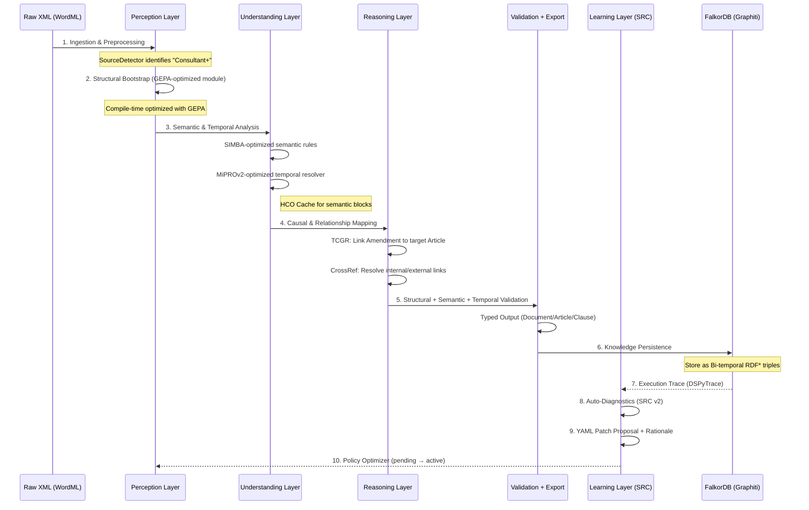

# Cognitive Workflow: From Raw XML to Temporal Knowledge Graph — v2.1

Схема жизненного цикла документа в системе LDUP.

## 📜 Описание внутренних процессов

1.  **Ingestion**: Очистка XML от шума Word (`w:proofErr`, `w:rsid`) на основе `docs/project_v1/ldup_system.yaml`.
2.  **Compile-time vs Run-time**: GEPA/SIMBA/MIPROv2 работают как оптимизаторы на compile-time. На run-time используется скомпилированный `dspy.Module`.
3.  **HCO Cache Interaction**:
    *   **Ключ**: `source_id + article_id + hash(text_block) + rules_version`.
    *   **Инвалидация**: при обновлении YAML или при смене источника документа.
    *   **Основа**: `dspy.cache` как нижний уровень, поверх него — LDUP-слой семантических блоков. GitHub v3.0.4: https://github.com/stanfordnlp/dspy/blob/3.0.4/dspy/clients/cache.py#L18
4.  **Validation Layer**:
    *   **Structural**: проверка вложенности (Article ∈ Chapter).
    *   **Semantic**: контроль модальностей (must/forbid/allow).
    *   **Temporal**: проверка интервалов `valid_from < valid_to` и конфликтов редакций.
5.  **Self‑Improvement**:
    *   **Auto‑Diagnostics** фиксирует отклонения и формирует YAML‑патчи.
    *   **Patch Metadata**: `error_type`, `source_id`, `example_fragment`, `rationale`.
    *   **Versioning**: патчи пишутся как `pending` и проходят симуляцию/валидацию перед активацией.
6.  **Typed Output**: результаты фиксируются как `Document → Chapter → Article → Clause` и экспортируются в AKN/LegalDocML-RU.
