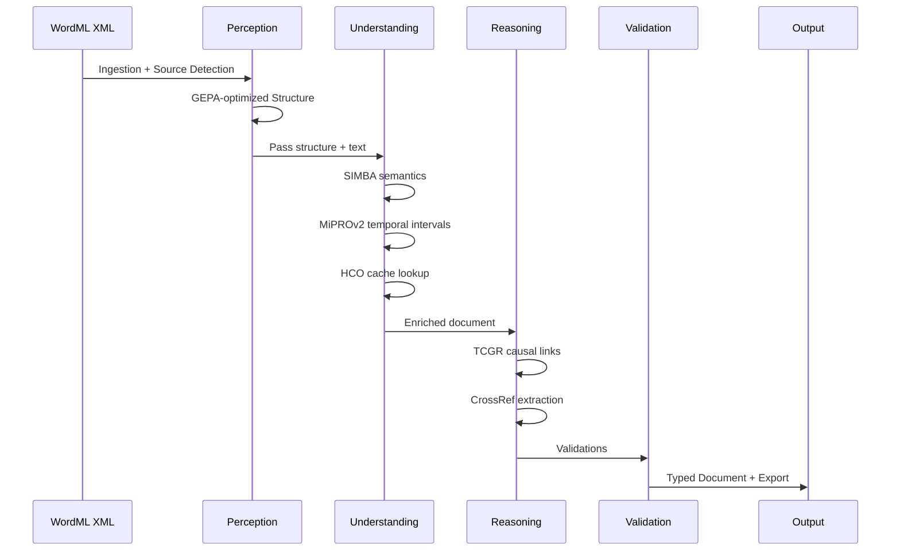
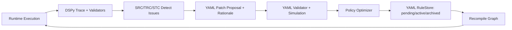
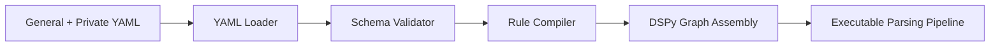
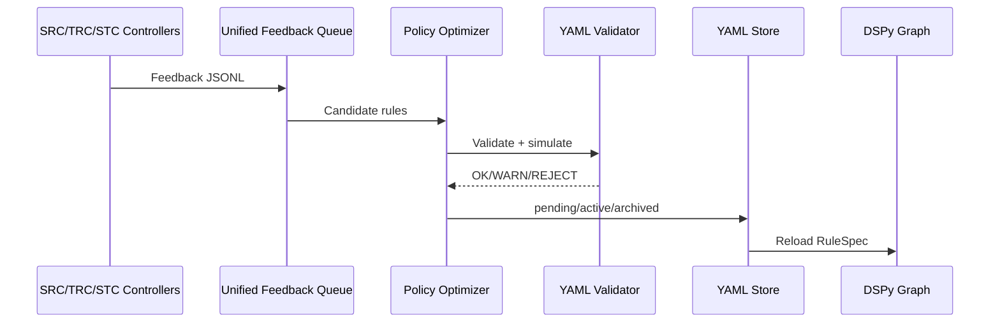

# LDUP v3 — Mermaid Diagrams

## 1) Architecture Overview

```mermaid
graph TB
    subgraph Perception [Perception]
        Ingest[Document Ingester] --> Source[Source Detector]
        Source --> Struct[GEPA-optimized Structural Module]
    end

    subgraph Understanding [Understanding]
        Struct --> Semantic[SIMBA-optimized Semantic Module]
        Semantic --> Temporal[MiPROv2-optimized Temporal Module]
        Temporal --> HCO[HCO Cache]
    end

    subgraph Reasoning [Reasoning]
        HCO --> TCGR[TCGR (custom)]
        TCGR --> CrossRef[Cross-Reference Resolver]
        CrossRef --> Graph[Graph Storage (FalkorDB/Graphiti)]
    end

    subgraph Validation [Validation]
        Graph --> StructuralV[Structural Validator]
        StructuralV --> SemanticV[Semantic Validator]
        SemanticV --> TemporalV[Temporal Validator]
    end

    subgraph SelfImprovement [Self-Improvement Core]
        TemporalV --> SRC[SRC/TRC/STC Controllers]
        SRC --> Queue[Unified Feedback Queue]
        Queue --> Policy[Policy Optimizer (custom)]
        Policy --> YAML[YAML RuleStore (pending/active/archived)]
        YAML --> Compiler[LDUP YAML Compiler]
        Compiler --> Struct
    end
```

## 2) Runtime Workflow



## 3) Self-Improvement Loop



## 4) YAML Compilation Pipeline



## 5) Policy Optimizer Decision Flow


