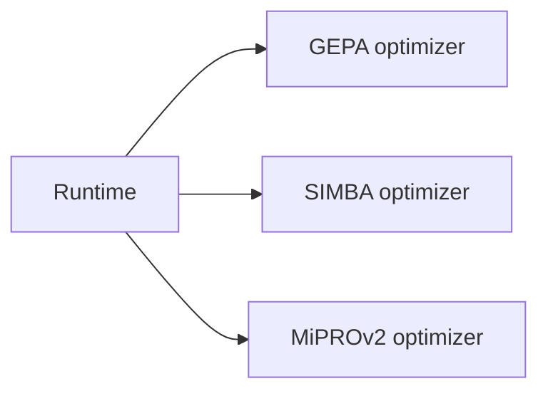
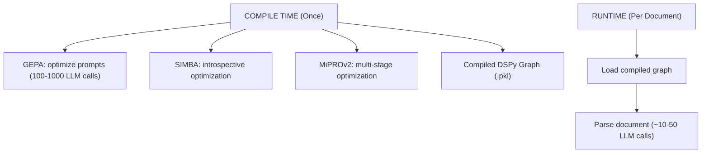

# Architecture Changelog: v3 → v4

## Executive Summary

LDUP v4 addresses **critical architectural flaws** in v3 that would have caused production failures. Changes focus on: **type safety, observability, testing, compile/runtime accuracy, and safety rails**.

---

## Critical Fixes

### 1. Compile-Time vs Runtime Separation

**Problem in v3:**

- GEPA/SIMBA/MiPROv2 shown as **runtime** components
- Implies per-document optimization (impossible: optimizers need 100-1000 LLM calls)
- Contradicts DSPy architecture (teleprompters are compile-time only)

**Fix in v4:**

- Clear separation: **compile-time** (once) vs **runtime** (per document)
- Matches actual DSPy behavior from source code
- **Files changed**: `architecture.md`, `workflow.md`, `mermaid.md`

**Impact:**
- Accurate performance expectations (compile takes minutes, runtime takes seconds)
- Correct caching strategy (compile once, reuse for all documents)
- Avoids attempting impossible per-document optimization

---

### 2. YAML → Pydantic + adaptix

**Problem in v3:**
```yaml
semantic:
  modalities:
    - pattern: "запрещается не"
      label: "prohibition_strong"
      priority: 5  # ❌ No type checking
      source_type: "consultantplus_xml"  # ❌ Typo: "consultantplus_xm" won't be caught
```
- Weak typing: typos not caught until runtime
- Whitespace fragility: indentation errors crash YAML loader
- No IDE autocomplete: must memorize field names
- No validation: can't check `priority` is in range 0-10
- Slow serialization: PyYAML is 10-100x slower than binary formats

**Fix in v4:**
```python
from pydantic import BaseModel, Field, validator
from adaptix import Retort

class SemanticRule(BaseModel):
    pattern: str
    label: str
    priority: int = Field(ge=0, le=10)  # ✅ Range validation
    source_type: str  # ✅ Type checking

    @validator("pattern")
    def pattern_not_empty(cls, v):
        if not v.strip():
            raise ValueError("pattern cannot be empty")
        return v

# Fast serialization (2-10x faster than Pydantic)
retort = Retort()
json_data = retort.dump(rule)
rule = retort.load(json_data, SemanticRule)
```
- **Pydantic**: Type-safe rule definitions with validation
- **adaptix**: Fast serialization for hot paths (LLM I/O)
- **Files changed**: NEW `serialization.md`, updated `architecture.md`

**Benefits:**
| Aspect | YAML (v3) | Pydantic + adaptix (v4) |
|--------|-----------|-------------------------|
| Type checking | Runtime only | Compile-time with mypy |
| Validation | None | Built-in validators |
| IDE support | None | Full autocomplete |
| Error messages | "YAML parse error" | "priority must be <= 10" |
| Performance | 10-100 ms | 1-5 ms (adaptix) |
| Testability | Hard (need YAML files) | Easy (Python objects) |

---

### 3. Add Testing Strategy

**Problem in v3:**
- No testing documentation at all
- No way to verify correctness before production
- Edge cases (empty documents, Cyrillic numbering, mixed formats) untested

**Fix in v4:**
```python
# Property-based testing with hypothesis
from hypothesis import given, strategies as st

@given(st.text(min_size=1))
def test_parser_handles_any_text(text):
    """Parser should never crash on any input text."""
    result = parser.parse(text)
    assert result is not None

@given(st.from_type(LegalDocument))
def test_output_is_valid(doc):
    """Output document should always be valid."""
    assert doc.chapters  # At least one chapter
    for chapter in doc.chapters:
        assert chapter.articles  # At least one article per chapter
```
- **hypothesis**: Property-based testing for edge cases
- **Unit tests**: Individual modules (GEPA, SIMBA, MiPROv2 wrappers)
- **Integration tests**: Full pipeline on 44-FZ documents
- **Regression tests**: Golden corpus with expected outputs
- **Files changed**: NEW `testing.md`

**Coverage Goals:**
- Unit: 90%+ for custom LDUP modules
- Integration: All major paths (perception → understanding → reasoning)
- Property: Critical functions (parsers, validators, transformers)

---

### 4. Add Observability

**Problem in v3:**
- No logging = impossible to debug production issues
- Can't track: which documents failed, why, what rules were applied
- No metrics: LLM calls per document, cache hit rate, accuracy by source

**Fix in v4:**
```python
from loguru import logger

# Structured logging with context
logger.bind(
    document_id=doc.id,
    source=doc.source_type,
    stage="perception"
).info("Processing document", extra={
    "size_bytes": len(doc.text),
    "estimated_llm_calls": 25
})

# Automatic exception tracking
try:
    result = parse_complex_structure(doc)
except ParseError as e:
    logger.error("Parse failure", exc_info=True)
    # Automatically includes full traceback
```
- **loguru**: Structured logging with levels, rotation, compression
- **Outputs**: Console (dev, color-coded), File (production, JSON lines)
- **Metrics**: Documents processed, LLM calls, cache hit rate, accuracy
- **Files changed**: NEW `observability.md`

**Logging Levels:**
| Level | Use Case | Example |
|-------|----------|---------|
| DEBUG | LLM prompts/responses | Full prompt for debugging |
| INFO | Processing steps | "Processing document 123" |
| WARNING | Fallback paths | "Using default parser for source X" |
| ERROR | Parser failures | "Failed to parse Chapter 5" |
| CRITICAL | System failures | "LLM API timeout, aborting" |

---

### 5. Add Safety Rails

**Problem in v3:**
```python
# v3 self_improvement.md - no safety limits
while accuracy_improvement > threshold:
    # ❌ Can loop forever
    # ❌ Can degrade accuracy
    # ❌ Can't rollback bad changes
    apply_rule(candidate_rule)
```
- Self-improvement can propagate errors indefinitely
- No rollback mechanism
- No convergence criteria
- One bad rule can break the entire system

**Fix in v4:**
```python
# v4 self_improvement.md - with safety rails
MAX_ITERATIONS = 10
MIN_IMPROVEMENT_THRESHOLD = 0.01  # 1% accuracy gain

for iteration in range(MAX_ITERATIONS):
    candidate_rule = generate_candidate_rule()

    # Test on validation set
    new_accuracy = validate_with_rule(candidate_rule)
    improvement = new_accuracy - current_accuracy

    if improvement < MIN_IMPROVEMENT_THRESHOLD:
        logger.info("Converged: improvement below threshold")
        break  # Convergence criterion

    if new_accuracy < baseline_accuracy * 0.95:
        logger.warning("Accuracy dropped >5%, rolling back")
        rollback_to_last_good_state()  # Rollback mechanism
        break  # Circuit breaker

    apply_rule(candidate_rule)
    current_accuracy = new_accuracy
```
- **Max iterations**: Prevent infinite loops
- **Minimum improvement threshold**: Convergence criterion
- **Rollback**: Revert changes if accuracy drops
- **Circuit breaker**: Abort if degradation >5%
- **Files changed**: `self_improvement.md`

---

## Technology Updates

### DSPy 3.0.4 → 3.1

**Changes in DSPy 3.1:**
- Bug fixes in optimizer compilation (critical for GEPA/MiPROv2)
- Better error messages for teleprompter failures
- Improved cache semantics (fixed cache invalidation bugs)
- Updated TypeScript definitions (better IDE support)

**Impact on LDUP:**
- More stable compile-time optimization
- Fewer "optimizer failed to converge" errors
- Better cache hit rates for repeated prompts

**Migration:**
```bash
# Update dependency
uv add "dspy==3.1"

# No code changes needed (API compatible)
```

---

### Add adaptix

**Why adaptix vs Pydantic serialization?**

| Aspect | Pydantic `.model_dump()` | adaptix `Retort()` |
|--------|-------------------------|-------------------|
| Speed | 10-50 ms | 1-5 ms (2-10x faster) |
| Dataclasses | Limited support | Native support |
| Error messages | Generic | Specific (field path) |
| Custom types | Possible but verbose | Simple converters |

**Use case:** Hot paths where serialization happens millions of times (LLM I/O, cache).

```python
from adaptix import Retort, NameConv

retort = Retort(
    name_conv=NameConv.CAMEL_CASE  # Match external API
)

# Serialize for LLM context
json_str = retort.dump(rule)

# Deserialize from cache
cached_rule = retort.load(json_bytes, StructuralRule)
```

---

### Add hypothesis

**Why property-based testing vs unit tests only?**

| Aspect | Unit Tests | hypothesis |
|--------|------------|------------|
| Coverage | Examples you think of | 100-1000 auto-generated cases |
| Edge cases | Manual | Automatic (empty, None, huge) |
| Shrinking | Manual | Automatic (minimal failing case) |
| Confidence | Low | High (exhaustive) |

**Example: Testing Cyrillic numbering**
```python
# Unit test (v3) - only tests ONE case
def test_parse_cyrillic_numbering():
    text = "Статья 1. Глава II."
    result = parse(text)
    assert result.article_number == "1"
    assert result.chapter_number == "2"

# Property-based test (v4) - tests ALL Cyrillic combinations
@given(st.from_regex(r"Статья \d+\. Глава [IVXLCDM]+\.", fullmatch=True))
def test_parse_any_cyrillic_numbering(text):
    """Should handle any Cyrillic numbering pattern."""
    result = parse(text)
    assert result.article_number.isdigit()
    assert result.chapter_number in ["I", "II", "III", "IV", "V", ...]
```

---

### Add loguru

**Why loguru vs standard logging?**

| Aspect | `logging` module | loguru |
|--------|------------------|--------|
| Setup | 10-20 lines | 1 line: `logger.add()` |
| Formatters | Complex format strings | Simple: `"{level} {message}"` |
| Exception handling | `exc_info=True` | Automatic with `.catch()` |
| Rotation | Manual `RotatingFileHandler` | Built-in: `rotation="1 day"` |
| Color output | Not supported | Built-in: colorized terminal |
| Diagnose | `logger.exception` | `logger.exception` with context |

**Example:**
```python
# Standard logging (v3 - if it existed)
import logging
logging.basicConfig(
    level=logging.INFO,
    format='%(asctime)s - %(name)s - %(levelname)s - %(message)s',
    handlers=[
        logging.FileHandler('app.log'),
        logging.StreamHandler()
    ]
)
logger = logging.getLogger(__name__)
# 10+ lines of setup

# loguru (v4)
from loguru import logger
logger.add("app.log", rotation="1 day", retention="7 days")
logger.info("Processing document")  # Just works
```

---

## Summary of Files Changed

| File | Status | Changes |
|------|--------|---------|
| `README.md` | Updated | Overview + changelog summary |
| `architecture.md` | Fixed | Compile/runtime separation, Pydantic + adaptix |
| `workflow.md` | Fixed | 2-phase workflow, logging steps |
| `testing.md` | NEW | hypothesis + unit/integration tests |
| `observability.md` | NEW | loguru logging + metrics |
| `serialization.md` | NEW | Pydantic + adaptix for rules |
| `self_improvement.md` | Fixed | Safety rails (rollback, circuit-breaker) |
| `mermaid.md` | Updated | Diagrams for compile/runtime separation |
| `CHANGELOG.md` | NEW | This file - detailed reasons |

---

## Migration Guide: v3 → v4

### Step 1: Update Dependencies
```bash
uv add "dspy==3.1" pydantic loguru hypothesis adaptix
```

### Step 2: Convert YAML Rules to Pydantic
```python
# Before (v3)
import yaml
rules = yaml.safe_load("rules.yaml")

# After (v4)
from pydantic import TypeAdapter
adapter = TypeAdapter(list[StructuralRule])
rules = adapter.validate_json(json.dumps(yaml_data))
```

### Step 3: Add Logging
```python
# Add to main.py
from loguru import logger
import sys

logger.remove()  # Remove default handler
logger.add(sys.stdout, level="INFO")
logger.add("logs/app.log", rotation="1 day", retention="7 days")
```

### Step 4: Add Property Tests
```python
# Add tests/property/test_parser.py
from hypothesis import given, strategies as st

@given(st.text())
def test_parser_never_crashes(text):
    result = parser.parse(text)
    assert result is not None
```

### Step 5: Add Safety Rails
```python
# In self-improvement loop
for iteration in range(MAX_ITERATIONS):
    # ... existing code ...
    if improvement < MIN_IMPROVEMENT_THRESHOLD:
        break
    if accuracy_dropped > 0.05:
        rollback()
        break
```

---

## Backward Compatibility

| Component | v3 Compatible? | Notes |
|-----------|----------------|-------|
| DSPy 3.1 | ✅ Yes | API compatible, bug fixes only |
| Pydantic rules | ⚠️ Partial | Need migration from YAML |
| loguru | ✅ Yes | Can coexist with existing code |
| hypothesis | ✅ Yes | Additive, no breaking changes |
| adaptix | ✅ Yes | Performance optimization, optional |

**Recommendation:** Migrate in phases:
1. Phase 1: Add loguru (no breaking changes)
2. Phase 2: Add hypothesis tests (additive)
3. Phase 3: Convert YAML to Pydantic (needs migration)
4. Phase 4: Add safety rails to self-improvement
5. Phase 5: Add adaptix for performance (optional)

---

## References

- DSPy 3.1 release notes: https://github.com/stanfordnlp/dspy/releases
- Pydantic v2 docs: https://docs.pydantic.dev
- adaptix docs: https://adaptix.readthedocs.io
- hypothesis docs: https://hypothesis.readthedocs.io
- loguru docs: https://loguru.readthedocs.io
