# LDUP v4 — Mermaid Diagrams

**All diagrams updated for v4 architecture with compile/runtime separation, safety rails, and new components.**

---

## 1. Architecture Overview (Compile + Runtime)

---

## 2. Compile-Time Workflow (Optimization)

---

## 3. Runtime Workflow (Per Document)

---

## 4. Self-Improvement Loop with Safety Rails

---

## 5. Safety Rails Decision Flow

```mermaid
flowchart TB
    Start([Candidate Rule Generated]) --> Backup["Backup Current Rule Store"]

    Backup --> Validate["Validate with Pydantic"]
    Validate -->|"Fail"| Reject["Reject Rule"]
    Validate -->|"Pass"| Simulate["Simulate on Mini-Corpus (N=20)"]

    Simulate --> CalcAcc["Calculate Accuracy"]
    CalcAcc --> CalcImprovement["Improvement = New - Baseline"]

    CalcImprovement --> Check1{"Improvement >= 1%?"}
    Check1 -->|"No"| Converge["Converged: Stop Loop"]
    Check1 -->|"Yes"| Check2{"New >= Baseline × 0.95?"}

    Check2 -->|"No"| CircuitBreaker["Circuit Breaker:<br/>Accuracy Dropped >5%"]
    Check2 -->|"Yes"| Check3{"Iteration < 10?"}

    Check3 -->|"No"| MaxIter["Max Iterations Reached"]
    Check3 -->|"Yes"| Activate["Activate Rule"]

    Activate --> UpdateStore["Update Rule Store:<br/>pending → active"]
    UpdateStore --> LogSuccess["loguru: Rule Activated"]
    LogSuccess --> Continue([Continue to Next Rule])

    CircuitBreaker --> Rollback["Rollback to Backup"]
    Rollback --> LogCB["loguru: Circuit Breaker Tripped"]
    LogCB --> Stop([Stop Self-Improvement])

    MaxIter --> LogMax["loguru: Max Iterations"]
    LogMax --> Stop

    Converge --> LogConv["loguru: Converged"]
    LogConv --> Stop

    Reject --> LogReject["loguru: Rule Rejected"]
    LogReject --> Continue

    style Start fill:#e1f5fe
    style Continue fill:#c8e6c9
    style Stop fill:#ffcdd2
    style Reject fill:#ffcdd2
    style Rollback fill:#ffcdd2
    style Activate fill:#c8e6c9
```

---

## 6. Data Flow: Pydantic + adaptix

---

## 7. Testing Strategy

---

## 8. Observability Pipeline

---

## 9. Technology Stack

---

## 10. Version Comparison: v3 vs v4

```mermaid
graph TB
    subgraph V3["v3 Architecture"]
        V3Compile["Compile-Time"]
        V3Runtime["Runtime"]
        V3SI["Self-Improvement"]

        V3Runtime -->|"Incorrect"| V3Compile
        V3SI -->|"No Safety"| V3Runtime
        V3Compile -->|"YAML"| V3Runtime
    end

    subgraph V4["v4 Architecture"]
        V4Compile["Compile-Time<br/>(Clear Separation)"]
        V4Runtime["Runtime<br/>(Fixed)"]
        V4SI["Self-Improvement<br/>(Safety Rails)"]

        V4Compile -->|"Graph.pkl"| V4Runtime
        V4Runtime -->|"Errors"| V4SI
        V4SI -->|"Safe"| V4Compile
        V4SI -->|"Rollback"| V4SI
    end

    subgraph Changes["Key Changes"]
        C1["DSPy 3.0.4 → 3.1"]
        C2["YAML → Pydantic + adaptix"]
        C3["Add loguru"]
        C4["Add hypothesis"]
        C5["Add Safety Rails"]
    end

    V3 -.->|"Fixed"| V4
    Changes --> V4

    style V3 fill:#ffcdd2
    style V4 fill:#c8e6c9
    style Changes fill:#fff3e0
```

---

## Diagram Legend

| Color | Meaning |
|-------|---------|
| 🟦 Blue | Compile-time / DSPy |
| 🟩 Green | Runtime / Success |
| 🟨 Orange | Optimization / Processing |
| 🟪 Purple | Observability / Testing |
| 🟥 Red | Error / Failure / Circuit Breaker |

---

## References

- Mermaid docs: https://mermaid.js.org
- DSPy 3.1: https://github.com/stanfordnlp/dspy
- Pydantic: https://docs.pydantic.dev
- adaptix: https://adaptix.readthedocs.io
- loguru: https://loguru.readthedocs.io
- hypothesis: https://hypothesis.readthedocs.io
