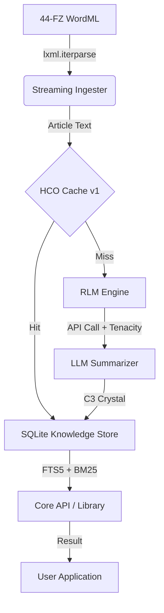
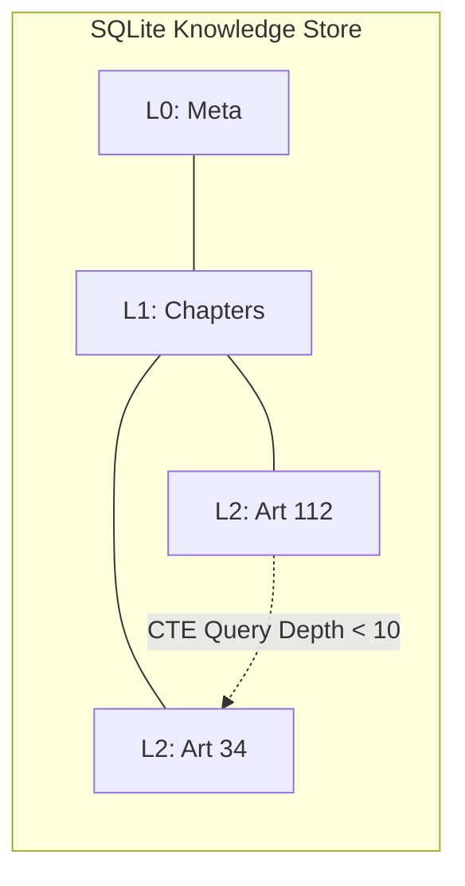

# Диаграммы архитектуры LDUP v5 (v5.1)

## 1. Потоковая обработка и индексация

```mermaid
graph TD
    A[44-FZ WordML] -->|lxml.iterparse| B(Streaming Ingester)
    B -->|Article Text| C{HCO Cache v1}
    C -->|Hit| D[SQLite Knowledge Store]
    C -->|Miss| E[RLM Engine]
    E -->|API Call + Tenacity| F[LLM Summarizer]
    F -->|C3 Crystal| D
    D -->|FTS5 + BM25| G[Core API / Library]
    G -->|Result| H[User Application]
```

## 2. Иерархия связей (TCGR)

```mermaid
graph LR
    subgraph SQLite Knowledge Store
    L0[L0: Meta] --- L1[L1: Chapters]
    L1 --- L2[L2: Art 34]
    L1 --- L2b[L2: Art 112]
    L2b -.->|CTE Query Depth < 10| L2
    end
```