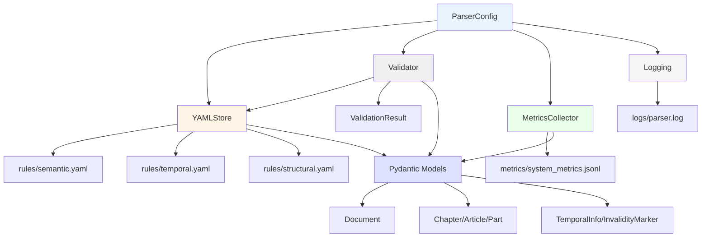

I have created the following plan after thorough exploration and analysis of the codebase. Follow the below plan verbatim. Trust the files and references. Do not re-verify what's written in the plan. Explore only when absolutely necessary. First implement all the proposed file changes and then I'll review all the changes together at the end.

## Наблюдения

Проект LDUP (Legal Document Universal Parser) представляет собой самообучающуюся систему на базе DSPy 3.0.4 с 7-слойной архитектурой (Perception→Understanding→Reasoning→Learning→Adaptation→Action→Evolution). Ключевые принципы: rule-first подход (70-80% детерминированных правил), YAML как декларативный язык правил, автоматическая адаптация через SRC-циклы обратной связи, минимизация использования LLM (≤20%). Стек: Python 3.13, UV, pydantic, structlog, pyyaml, pymorphy3, razdel, dspy, lxml. Старый проект в `prompt_domain_44fz/` содержит ценные YAML-структуры для парсинга, валидации и правил, которые нужно адаптировать под новую архитектуру.

## Подход

Фаза 1 закладывает фундамент инфраструктуры: создаём типобезопасные Pydantic модели для всей иерархии документов (Document→Chapter→Paragraph→Article→Part→Clause→Subclause) согласно `file:docs/project_v1/arch_v0.03.md`, реализуем YAMLStore с версионированием и жизненным циклом правил (candidate→validated→active→archived) по `file:docs/project_v1/Architecture scheme in YAML-(ldup_architecture.yaml).md`, создаём Validator с трёхуровневой проверкой (syntax/logical/empirical) из `file:docs/project_v1/Mermaid-YAML-RuleSpec-DSPy Graph-Verified Algorithm.md`, настраиваем structlog для структурированного логирования и MetricsCollector для отслеживания точности/токенов/конфликтов, и реализуем ConfigLoader на базе pydantic-settings. Все компоненты модульные, расширяемые и готовы к интеграции с DSPy Graph в следующих фазах.

## Инструкции по реализации

### 1. Структура проекта

Создать базовую структуру директорий согласно `file:docs/plan-v3-:-develop-regulatory-parser.md` (строки 289-359):

```
src_parser/
├── core/
│   ├── __init__.py
│   ├── models.py          # Pydantic модели
│   ├── config.py          # ConfigLoader
│   ├── logging.py         # Structlog setup
│   ├── metrics.py         # MetricsCollector
│   └── exceptions.py      # Custom exceptions
├── storage/
│   ├── __init__.py
│   ├── yaml_store.py      # YAMLStore
│   └── validator.py       # Validator
└── __init__.py

tests/
├── core/
│   ├── test_models.py
│   ├── test_config.py
│   ├── test_logging.py
│   └── test_metrics.py
└── storage/
    ├── test_yaml_store.py
    └── test_validator.py

rules/                     # YAML rules storage
├── semantic.yaml
├── temporal.yaml
└── structural.yaml

config/
└── parser_config.yaml     # Parser configuration

feedback/                  # SRC feedback queue
logs/                      # Structured logs
metrics/                   # Metrics output
```

### 2. Pydantic модели (`src_parser/core/models.py`)

Реализовать иерархию моделей согласно `file:docs/project_v1/arch_v0.03.md` (строки 136-157) и `file:docs/plan-v3-:-develop-regulatory-parser.md` (строки 360-400):

**Базовые модели:**

- `BaseNode`: базовый класс с `id`, `type`, `confidence`, `source_origin`, `metadata`
- `TemporalInfo`: `effective_from`, `effective_to`, `publication_date`, `amendment_dates[]`
- `InvalidityMarker`: `is_invalid`, `invalidation_date`, `invalidation_reason`, `invalidation_type` (full/partial/non_applicable)
- `Modality`: enum (obligation, prohibition, permission, definition, sanction)
- `SourceMetadata`: `source_type` (ConsultantPlus/Garant/etc), `format` (WordML/DOCX/PDF), `encoding`, `version`

**Иерархические модели:**

- `Document`: корневой узел с `title`, `law_number`, `document_type`, `language`, `temporal_info`, `source_metadata`, `chapters[]`, `metadata_extracted`
- `Chapter`: `number`, `title`, `paragraphs[]`, `articles[]`, `parent_id`
- `Paragraph`: `number`, `title`, `articles[]`, `parent_id` (опциональный, только в некоторых законах)
- `Article`: `number`, `title`, `parts[]`, `invalid_marker`, `modalities[]`, `parent_id`
- `Part`: `number`, `text`, `clauses[]`, `modalities[]`, `parent_id`
- `Clause`: `number`, `text`, `subclauses[]`, `modalities[]`, `parent_id`
- `Subclause`: `letter`, `text`, `modalities[]`, `parent_id`

**Дополнительные модели:**

- `ParsingResult`: обёртка для результата парсинга с `document`, `errors[]`, `warnings[]`, `metrics`, `confidence_score`
- `FeedbackEntry`: для SRC feedback с `timestamp`, `module`, `error_type`, `suggestion`, `confidence`

Использовать `Field()` для валидации, `validator` для кастомных проверок, `Config` с `frozen=False` для мутабельности во время парсинга. Добавить методы `to_dict()`, `from_dict()`, `to_json()` для сериализации.

### 3. YAMLStore (`src_parser/storage/yaml_store.py`)

Реализовать хранилище YAML-правил согласно `file:docs/project_v1/Architecture scheme in YAML-(ldup_architecture.yaml).md` (строки 40-51) и `file:docs/project_v1/cycle SRC-feedback → YAML-patch.md`:

**Класс `YAMLStore`:**

- `__init__(rules_dir: Path)`: инициализация с путём к директории правил
- `load_rules(rule_type: str) -> dict`: загрузка semantic.yaml/temporal.yaml/structural.yaml
- `save_rules(rule_type: str, rules: dict)`: сохранение с автобэкапом
- `add_pending_rule(rule_type: str, rule: dict)`: добавление правила со статусом "pending"
- `promote_rule(rule_type: str, rule_id: str, status: str)`: изменение статуса (pending→validated→active)
- `archive_rule(rule_type: str, rule_id: str)`: архивирование устаревших правил
- `get_active_rules(rule_type: str) -> list`: получение только активных правил
- `get_rule_history(rule_type: str, rule_id: str) -> list`: история изменений правила
- `merge_general_and_private(general_yaml: Path, private_yaml: Path) -> dict`: слияние общих и частных правил

**Жизненный цикл правил** (из `file:docs/project_v1/Architecture scheme in YAML-(ldup_architecture.yaml).md`, строки 143-158):

- `candidate`: новое правило от SRC
- `validated`: прошло валидацию
- `active`: применяется в DSPy Graph
- `archived`: отклонено/устарело

Реализовать версионирование через Git-подобную систему или timestamp-based snapshots. Добавить `auto_backup=True` с ротацией бэкапов (хранить последние 10 версий). Использовать `pyyaml` с `safe_load`/`safe_dump`.

### 4. Validator (`src_parser/storage/validator.py`)

Реализовать трёхуровневую валидацию согласно `file:docs/project_v1/Mermaid-YAML-RuleSpec-DSPy Graph-Verified Algorithm.md` (строки 74-81) и `file:docs/project_v1/cycle SRC-feedback → YAML-patch.md` (строки 71-89):

**Класс `Validator`:**

- `__init__(schema_path: Path, simulation_corpus_size: int = 20)`
- `validate_syntax(rules: dict) -> ValidationResult`: проверка YAML-схемы, типов, обязательных полей
- `validate_logical(rules: dict) -> ValidationResult`: проверка конфликтов, циклов, иерархии, приоритетов
- `validate_empirical(rules: dict, corpus: list[Document]) -> ValidationResult`: симуляция на корпусе документов
- `validate_full(rules: dict) -> ValidationResult`: полная валидация (syntax→logical→empirical)

**ValidationResult:**

- `is_valid: bool`
- `errors: list[str]`
- `warnings: list[str]`
- `metrics: dict` (accuracy_gain, conflict_count, coverage)
- `report: str` (форматированный отчёт)

**Проверки:**

- Syntax: YAML schema validation, обязательные поля (pattern, action), типы данных
- Logical: конфликты паттернов (дубликаты, пересечения), циклические зависимости, корректность иерархии правил
- Empirical: применение на 20 тестовых документах, сравнение с ground truth (если есть), расчёт accuracy gain

Использовать `pydantic` для schema validation, regex для проверки паттернов, симуляцию через мок-парсер.

### 5. Logging (`src_parser/core/logging.py`)

Настроить structlog согласно `file:docs/project_v1/Architecture scheme in YAML-(ldup_architecture.yaml).md` (строки 49-54):

**Функция `setup_logging(log_level: str = "INFO", log_dir: Path = Path("logs"))`:**

- Конфигурация structlog с процессорами: `add_log_level`, `add_timestamp`, `JSONRenderer` для production, `ConsoleRenderer` для dev
- Вывод в файл `logs/parser.log` (JSON Lines формат) и консоль
- Ротация логов (по размеру 10MB или ежедневно)
- Контекстные логгеры для каждого модуля: `get_logger(module_name: str)`

**Структура лог-записи:**

```json
{
  "timestamp": "2026-01-10T14:35:00Z",
  "level": "info",
  "module": "yaml_store",
  "event": "rule_promoted",
  "rule_id": "temporal_001",
  "status": "active",
  "confidence": 0.91
}
```

Использовать `structlog.stdlib.BoundLogger` для типобезопасности. Добавить фильтры для чувствительных данных (API keys, токены).

### 6. Metrics (`src_parser/core/metrics.py`)

Реализовать MetricsCollector согласно `file:docs/project_v1/Architecture scheme in YAML-(ldup_architecture.yaml).md` (строки 100-113):

**Класс `MetricsCollector`:**

- `__init__(output_file: Path = Path("metrics/system_metrics.jsonl"))`
- `track_accuracy(module: str, accuracy: float)`
- `track_llm_usage(module: str, tokens: int, cost: float)`
- `track_rule_conflicts(rule_type: str, conflict_count: int)`
- `track_parsing_time(document_id: str, time_seconds: float)`
- `track_temporal_resolution(accuracy: float)`
- `get_metrics_summary() -> dict`: агрегированные метрики
- `export_metrics() -> None`: сохранение в JSONL
- `check_thresholds() -> list[Alert]`: проверка пороговых значений (accuracy_drop > 0.03, llm_spike > 0.05)

**Метрики** (из `file:docs/project_v1/Architecture scheme in YAML-(ldup_architecture.yaml).md`, строки 102-108):

- `accuracy`: точность парсинга по модулям (GEPA, SIMBA, MiPROv2)
- `llm_usage`: процент использования LLM, количество токенов, стоимость
- `rule_conflicts`: количество конфликтов правил
- `parsing_time`: время парсинга на документ/страницу
- `temporal_resolution_accuracy`: точность извлечения дат

Использовать `dataclasses` для метрик, `jsonlines` для записи, `datetime` для timestamp. Добавить агрегацию по интервалам (hourly/daily/weekly).

### 7. Config (`src_parser/core/config.py`)

Реализовать ConfigLoader на базе pydantic-settings согласно `file:docs/plan-v3-:-develop-regulatory-parser.md` (строки 401-430):

**Класс `ParserConfig(BaseSettings)`:**

- `project_name: str = "law-parser"`
- `version: str` (из pyproject.toml)
- `log_level: str = "INFO"`
- `rules_dir: Path = Path("rules")`
- `feedback_dir: Path = Path("feedback")`
- `metrics_dir: Path = Path("metrics")`
- `logs_dir: Path = Path("logs")`
- `yaml_schema_path: Path = Path("config/rule_schema.yaml")`
- `simulation_corpus_size: int = 20`
- `llm_usage_limit: float = 0.2` (20%)
- `confidence_threshold: float = 0.95`
- `auto_backup: bool = True`
- `backup_retention_days: int = 60`

**Загрузка конфигурации:**

- Из `pyproject.toml` через `tomli` (Python 3.13 встроенный)
- Из переменных окружения через `.env` (python-dotenv)
- Из `config/parser_config.yaml` (опционально)
- Приоритет: env vars > config file > defaults

Использовать `pydantic_settings.BaseSettings` с `model_config = SettingsConfigDict(env_prefix="LDUP_")`. Добавить валидацию путей (создание директорий при необходимости).

### 8. Exceptions (`src_parser/core/exceptions.py`)

Определить кастомные исключения:

- `LDUPException`: базовое исключение
- `YAMLStoreError`: ошибки работы с YAML
- `ValidationError`: ошибки валидации (переопределение pydantic)
- `ConfigurationError`: ошибки конфигурации
- `ParsingError`: ошибки парсинга
- `RuleConflictError`: конфликты правил

Каждое исключение с `message`, `module`, `context` для детального логирования.

### 9. Тестирование

Создать unit-тесты с pytest:

**test_models.py:**
- Создание и валидация всех моделей
- Сериализация/десериализация (to_dict, from_dict, to_json)
- Валидаторы (номера статей, даты, иерархия)
- Edge cases (пустые поля, некорректные типы)

**test_yaml_store.py:**
- Загрузка/сохранение правил
- Жизненный цикл правил (candidate→validated→active→archived)
- Версионирование и бэкапы
- Слияние general/private YAML
- Конкурентный доступ (если применимо)

**test_validator.py:**
- Syntax validation (корректные/некорректные YAML)
- Logical validation (конфликты, циклы)
- Empirical validation (симуляция на мок-документах)
- Пороговые значения и алерты

**test_logging.py:**
- Настройка логгеров
- Форматирование (JSON/Console)
- Ротация логов
- Контекстные логгеры

**test_metrics.py:**
- Трекинг метрик
- Агрегация
- Экспорт в JSONL
- Проверка пороговых значений

**test_config.py:**
- Загрузка из разных источников
- Приоритеты (env > file > defaults)
- Валидация путей
- Создание директорий

Использовать `pytest-asyncio` для async тестов, `pytest-cov` для coverage (цель ≥95%), `hypothesis` для property-based testing (если применимо).

### 10. Интеграция с существующими YAML

Адаптировать YAML из старого проекта:

**Из `file:prompt_domain_44fz/parsing_prompt.yaml`:**
- Извлечь hierarchy patterns (строки 31-140) → `rules/structural.yaml`
- Извлечь invalidity_detection (строки 142-162) → `rules/semantic.yaml`
- Извлечь temporal_markers (строки 165-179) → `rules/temporal.yaml`

**Из `file:prompt_domain_44fz/validation/semantic_rules.yaml` и `structural_rules.yaml`:**
- Адаптировать правила валидации под новый Validator
- Добавить confidence scores и priority

**Структура новых YAML:**

```yaml
# rules/semantic.yaml
version: "1.0.0"
modalities:
  - type: "obligation"
    patterns: ["обязан", "должен"]
    confidence: 0.95
  - type: "prohibition"
    patterns: ["запрещается", "не допускается"]
    confidence: 0.95
invalidity_markers:
  - pattern: "утратила? силу"
    type: "full_invalidation"
    confidence: 0.99
```

### 11. Документация

Создать docstrings для всех классов и функций в формате Google Style. Добавить README.md с описанием архитектуры Phase 1, примерами использования, инструкциями по запуску тестов.

### Диаграмма компонентов Phase 1



### Критерии успеха Phase 1

- ✅ Все Pydantic модели определены и протестированы (coverage ≥95%)
- ✅ YAMLStore работает с жизненным циклом правил и версионированием
- ✅ Validator выполняет трёхуровневую валидацию (syntax/logical/empirical)
- ✅ Structlog настроен с JSON/Console выводом и ротацией
- ✅ MetricsCollector отслеживает все ключевые метрики
- ✅ ConfigLoader загружает конфигурацию из pyproject.toml и .env
- ✅ Все тесты проходят (pytest -v --cov=src_parser)
- ✅ YAML из старого проекта адаптированы под новую структуру